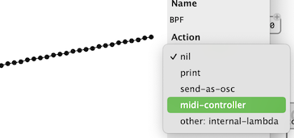
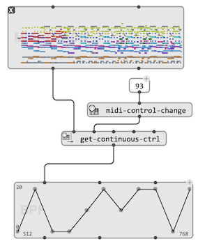

# MIDI Continuous Controllers

Continuous controllers are settings that can be sent to a MIDI synthesizer, usually through messages of type `ControlChange`. `ControlChange` messages apply to specific MIDI channels. The type of control as well as the setting value are given as message parameters (or "values"), both given in the range 0-127.

> 
>
> The ["General MIDI" standard](https://www.midi.org/specifications-old/item/general-midi) defines a set of controllers corresponding to control numbers (e.g. Volume, Panning, etc.). Some control numbers are left undefined and freely assignable. 
>
> The utility box `midi-control-change` allows retrieving the control number corresponding to standard General MIDI controllers. 

The second value of the  `ControlChange` message is the value set to the designated control (aslo in the range 0-127).
For specific message types requiring more precision, additional events are used for "fine control".

> **Note:** `PitchBend` is a special kind of control, with its own type of MIDI message. Therefore the setting can be specified with more precision using the two value fields of the MIDI messages, offering a range of 0-16383 for a pitch deviation of ±2 semi-tones. Some OM# functions treat `PitchBend` as just another kind of continuous controller. 

## Sending Continuous Controllers

The function `ctrlchg` sends a Control Change message of specified type and value to a given MIDI channel on a given (optional) output port.

> `volume` sends a value specifically targeted at control #7 (I.e. "Channel Volume", according to ["General MIDI" standard](https://www.midi.org/specifications-old/item/general-midi)).

> `pitchwheel` sends a pitch bend message (0-16383, with 8192 = no bend) to a given MIDI channel on a given (optional) output port. `pitchbend` does the same with a bvalue range of 0-127, and 64 = no bend.
 

> The `midi-reset` functions sends a special controller (#121) which reset all controllers to their default.

## Generating Continuous Controllers as `MIDIEVENTS` 

To generate continuous controller messages as [`MIDIEVENTs`](midi-events), just initialize it with the corresponding type of event and control number. Use the `onset` to set a time and generate any control sequence.

> Example: Generation of `MIDIEVENTs` for a constinuous controller using a [loop](loop) (100 events at intervals of 100ms).
> 
>  

## Using BPF actions

[BPF](bpf) and other ["time sequences"](time-sequence) can be assigned actions to perform for each contained timed iteam during [playback](player). It is therefore possible to the this action as a patch sending continuous controllers (or any kind of MIDI events).

> One of the default actions in the [BPF](bpf) editor is `midi-controller`: this action atomatically sets the action to send a MIDI continuous controller, with a given control number and the values as read in the BPF.

 &rarr; 

## Extracting Continuous Controllers

The function `get-continuous-ctrl` collects the events of a given continuous control type on specified tracks and channels, and returns them as a [`BPF`](bpf) (time, values).  

