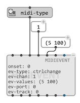
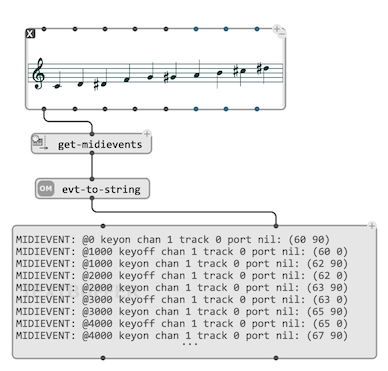
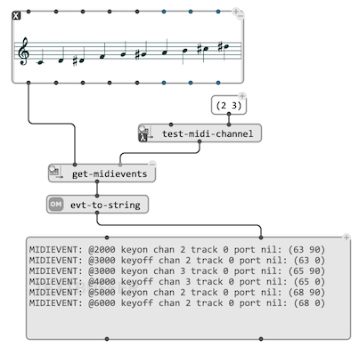
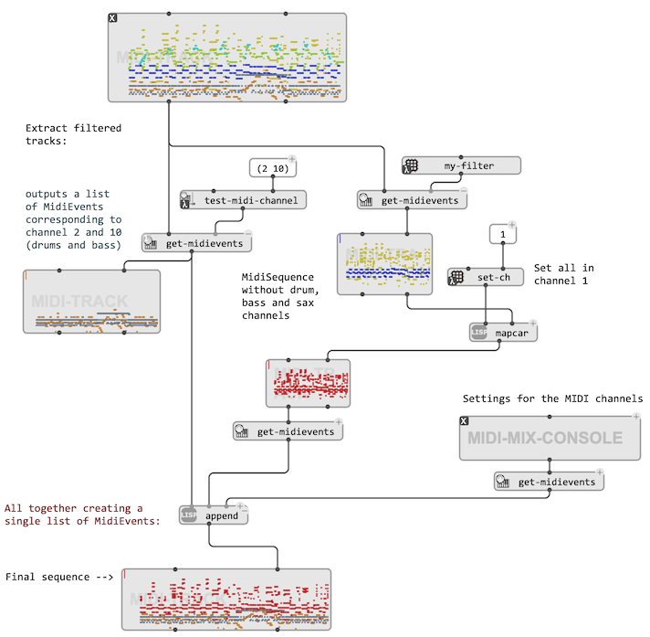

# MIDI Events

It is possible to ignore most of the underlying [MIDI infrastructure and concepts](midi-basics) when using score objects in OM#; however, some tools and data structures presented here allow working with it to process or render other musical structures.

## The class `MIDIEVENT`

The class `MIDIEVENT` represents a simple MIDI message. It can be parameterized and sent out to a MIDI port, or processed and grouped along with other events to consitute musical sequences, typically in a [`DATA-STREAM`](data-stream), a [`MIDI-TRACK`](midi-track) container, or in a [Sequencer](sequencer).

`MIDIEVENT` slots correspond to the basic attributes of a MIDI message:
- `:ev-type` the type of message (can be set wit the `midi-type`utility)
- `:ev-chan` the channel of the message (1-16)
- `:ev-values` a list of values, depending on the type of message.

Although not part of the MIDI message format, `MIDIEVENT` also includes two other parameters which help its manipulation and processing in the software:
- `:ev-port` indicates a MIDI port number where this even should be [sent](midi-out).
- `:ev-track` (additional [keywork input](box-inputs#keyword)) indcates a MIDI track for this event.

> In MIDI, [notes](midi-basics#midi-notes) are expressed by the succession of two events of types `KeyOn` and `KeyOff`, which correspond to the activation and release of a given “key”. &rarr; [`MIDI-NOTE`](midi-track#midi-note) is a specialized class suitable to represent a note at higher, "musical" level, and adapted to [`MIDI-TRACK`](midi-track) containers.

## Extracting and processing `MIDIEVENTs`

**`get-midievents`** is a generic functions allowing to extract a list of `MIDIEVENT` from a [`MIDI-TRACK`](midi-track), or any compatible musical object:

> **Note:** We use `evt-to-string` to control the list of `MIDIEVENT` as text in a [`TEXTBUFFER`](textbuffer).

The [optional input](box-inputs#optional) `:test` allows connecting a test (a filter function or a patch in [lambda mode](lambda)) in order to filter the list returned by `get-midievents`. The filter function must have one single free input, correponding to an input `MIDIEVENT`. 

Available filters include `test-midi-channel`, `test-midi-type`, `test-midi-track`, `test-date`, etc. (see MIDI [package](session#the-packages-library-tab)).

`MIDIEVENTs` can be recomposed into a new list and provided as input to [`MIDI-TRACK`](midi-track) and/or [saved to a file](midi-save) to compose a new consolidated sequence.

> The [Help patches](help) in the MIDI section provide advanced examples of MIDI event extraction and filtering.
>
> 

## Extracting additional MIDI info

A few other utilities in the MIDI package allow extracting or converting sepcific kinds of MIDI info:

- `mf-info` returns the MIDI notes info as processed and sorted lists of pitch, velocity, duration for each MIDI track.  
- `get-tempomap` returns lists with tempo changes.
- `convert-textinfo` converts the `ev-values` field of `MIDIEVENT` objects of different textual types from ASCII code to readable text.
- `get-mf-lyrics` return the contents of messages of type `:lyrics` convcerted as text
- ...