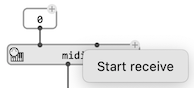
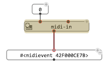
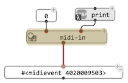
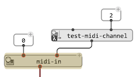
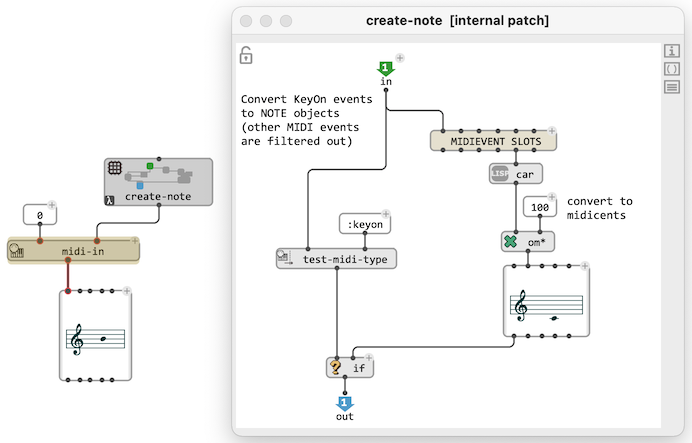
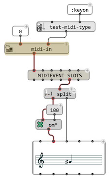
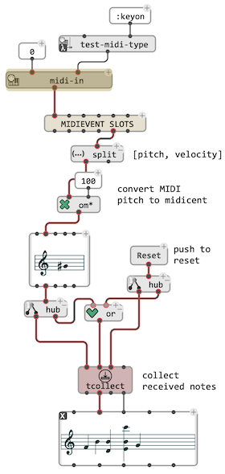

# Receiving MIDI

## Getting MIDI events in visual programs

`midi-in` is a specal "receive box": when set [reactive](reactive) (with <kbd>R</kbd> or using the right/<kbd>Ctrl</kbd>-click context menu) it starts running a receiving process on a MIDI port set or connected to it's first input, and delivers received messages as [`MIDIEVENT`](midi-events) objects on its output. 
&rarr; The box frame gets colored while the receiving process is running.

If connected to other boxes, the received `MIDIEVENTs` can therefore be dynamically transferred down a [reactive OM# program](reactive).

   

&rarr; Use the same <kbd>R</kbd> short cut or context ,menu to stop the receive process.

#### Pre-processing incoming events

The second input of `midi-in` (`msg-processing`) is a [lambda patch or a lambda function](lambda) called with each received [`MIDIEVENT`](midi-events) before to deliver it to the box output:

MIDI test-utilities (`test-midi-channel`, `test-midi-type`, `test-midi-track`,...) can be used here for instance, in order to filter incoming events. When the `msg-processing` function returns `NIL`, nothing is delivered to the `midi-in` output.

More complex processes can for isntance pre-format incoming events. The example below filters `KeyOn`events and turns them into OM# `NOTE` objects.

#### Reactive processing of events

A [reactive connection](reactive) can be set to the `midi-in` output to process the delivered data. `MIDIEVENT` filters and other utilities can also be used at that stage. The example below now performs the conversion of MIDIEVENt to `NOTE` as a reactive process:

#### Collecting events

The events pushed through reactive processes by `midi-in` can be collected using the [`collect`](memory#collect)/[`tcollect`](memory#tcollect) utilities.

> &rarr; See [Memory](memory).

> **Note:** `midi-in` needs to be turned off and on again if an error occurs during the propagation of an incoming event, in order to reset the receiving process.

--------

## Recording in MIDI and Score editors

The [`MIDI-TRACK`](midi-track), [`CHORD-SEQ`](chord-seq), [`VOICE`](voice), and [`POLY`](poly) editors feature a "Record" button as part of the [transport controls](player). 

MIDI notes (as well as other events in `MIDI-TRACK`) received on the default MIDI Input port (see [MIDI Settings](midi-settings)) will be added on the fly to the sequence if the record button is on while the sequence is played.

> In `POLY` / `MULTI-SEQ` editors, notes will be added into the selected voice, if any, or by default to the first voice. 

## Bad connections!

> Using the same [MIDI bus](midi-settings#virtual-buses) for MIDI IN and OUT can create undesired effects when recording on top of existing contents: the MIDI notes played would be immediately be re-recoreded on top of themselves (sometimes with a slight delay). If the [MIDI "Thru"](midi-settings#midi-"thru") option is active and also connected to the same bus, re-coreded notes will be re-recorded again and again, producing infinite loops with potentially devastating effects!