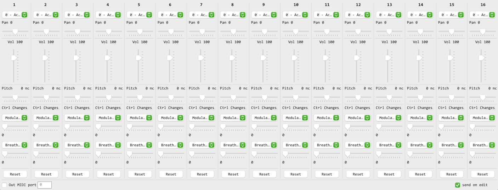
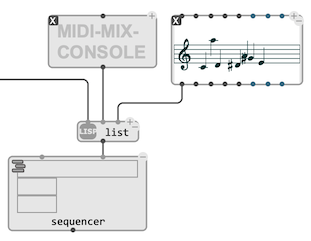

# MIDI Mix Console

`MIDI-MIX-CONSOLE` is a utility object to use both as a mixing console for MIDI, and a container for MIDI events describing the state of a number of controllers for each MIDI channels at a given time.

## Editor

The `MIDI-MIX-CONSOLE` editor provides an iterface to set the following controls for the 16 MIDI channels:
- **Program number**: Which "instrument" is assigned to this channel
- **Panning** (-63 to 64)
- **Volume** (0-127)
- **Pitch Bend** (-200 to 200 midicents)
- **2 other control changes** (selectable by a chooser, and also with values between 0-127)

In addition:

- A "Reset" button on each channel allows resetting to default values. 
- The "Port" attributes targets a MIDI output port (or the default output port if not specified)

> &rarr; The "send on edit" check box enables sending MIDI messages in real-time each time a setting is changed from the editor.

## Usage in MIDI sequences

The contents of a `MIDI-MIX-CONSOLE` can be extracted as a list of [`MIDIEVENTs`](midi-events) using the `get-midievents` generic function, and then processed and used along with other MIDI or musical structures.

 `MIDI-MIX-CONSOLE` can also be used as a timed MIDI settings container in a [Sequencer](sequencer):

 
