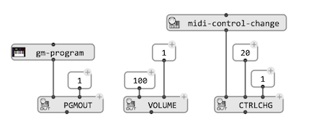
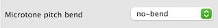
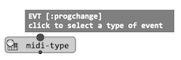
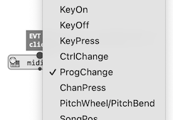
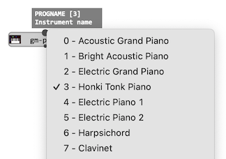
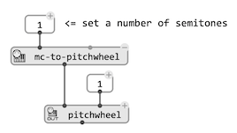

# Sending MIDI

There exist different means to send MIDI messages out from OM#. The main situations are:

 

- [Playing](player) a Score or MIDI object: [`CHORD`](chord), [`CHORD-SEQ`](chord-seq), [`VOICE`](voice), [`POLY`](poly), [`MIDIEVENT`](midi-events), [`MIDI-TRACK`](midi-track)...
- Sending out through the functions of the "MIDI/Out" package: these functions send MIDI when evaluated (&rarr;).
- Assigning an action to other playable structures like BPF (see [Continuous Controllers](continuous-controllers)).

> All MIDI-out events are sent to a specified port (or to the default MIDI out port if unspecified). See [MIDI Settings](midi-settings) for details about how to configure and connect MIDI ports to synthesizers. 

> **Note — Microintervals:** Setting the pitch bend of some MIDI channels (in particular, using the `pitchwheel` function) is a means to let MIDI synthesizers render microintervals when playing OM# score objects. See the different options for microtonal tuning in the [Preferences](preferences) / Score tab. 
> 

## MIDI / General MIDI Standards

MIDI events can be of different types, and the semantics of values is generally unified through a number of layers of the standard protocol (most notably, the ["General MIDI" standard](https://www.midi.org/specifications-old/item/general-midi)). 

OM# provides a set of utilities to get these to numeric values required to initialize MIDI events or MIDI sending functions, using [input menus](box-inputs#input-menus):

- `midi-type`: allows to select a MIDI event type identifier

- `midi-control-change`: retuns the number corresponding to a given controller (e.g. "Volume", "Pan", "PitchBend", ...) suitable to parameterize the first value of a ControlChange event.

- `gm-program`: returns the program number corresponding to a given instrument timbre, suitable to set the second value of a MIDI event of type "ProgramChange".

- `gm-drumnote`: returns the pitch (or key number) corresponding to a given drum, suitable to set the first value of a KeyOn/KeyOff event sent on channel 10. 
- `mc-to-pitchwheel`: returns the value corresponding to a given number of midicents pitch shifting, suitable to set the second value of a "PitchWheel" ControlChange event.

 
