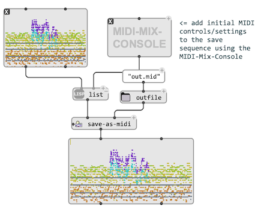

# Save as MIDI

MIDI is also a file format: musical structures encoded as MIDI can be stored in this format.

One single function (`save-as-midi`) can be used to save any compatible object as MIDI file:

> ## Compose your own MIDI files
> 
> A list of [MIDIEVENTs](midi-events) can also be saved as MIDI. This list can be constituted and processed freely from visual programs.
>
> 
