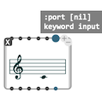
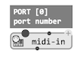
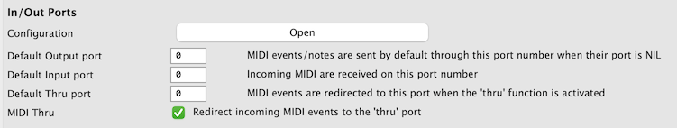
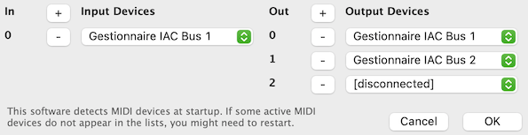

# MIDI Settings

OM# sends and receives MIDI through virtual ports, identified by numbers. The MIDI **port** is an internal setting found in all the functions and data structures involved with communicating MIDI (e.g. MIDI notes). It can generally be left to `NIL`, and fallback to the default port.

     

Score objects and other "MIDI" objects will not sound util their target MIDI port is connected to a MIDI synthesizer or device.
&rarr; You need to have a MIDI synthesizer or device running or connected to your system, and set the MIDI connections accordingly, from the "MIDI" tab of [OM# preferences](preferences).

 

### Connecting ports to MIDI devices

The "Configuration" button will allow you to set the routing of OM# MIDI port numbers to the external MIDI devices and synthesizers detected on your computer.

 

Add in/out ports using the `+` button (remove them with the `-` buttons).

Output ports are for [playing MIDI (sending events)](midi-out). Input ports are fore [receiving and recording MIDI](midi-in) (e.g. from a keyboard, device, or another application).

For each port, a menu allows you to select any connected device or syhthesizer. In the device lists you will see all detected MIDI synths or buses.

> **Important note:** OM# detects MIDI devices at startup; therefore it is possible that a synthesizer started after OM# be not in the list of available MIDI devices. The contents of these menus depends the devices and synthesizers running and connected when you started OM#: You need to restart OM if you connect or start another synth or device that you want to use.     
> **&rarr; See note below about virtual buses, and other platform-spefcific hints**.

### Default port

Whenever `NIL` is left as port value, or when there is no option to set the port value, the default input or output ports set in the Preferences will be used.

### MIDI "Thru"

MIDI "Thru" is an option allowing every MIDI event coming in to be also immediately sent back to another port. The port number is also defined as a preference and connected according to the output ports configuration.

-------

> ### Virtual Buses:
>
>Your system may allow you to enable virtual MIDI buses (e.g. IAC buses on macOS).
>Virtual MIDI buses allow to abstract the device connection issues out from OM# (e.g. connect port 0 to IAC bus 1 and then set IAC bus 1 as the input of your synthesizer). Therefore devices and synthesizers can be connected and diconnected anytime to them, without needing to restart and reconfigure.     
> &rarr; [More info (and how to use this with Live)](https://help.ableton.com/hc/en-us/articles/209774225-Using-virtual-MIDI-buses-in-Live)

> ### Platform hints:
>
> **MacOS**    
> &rarr; MacOS has no embedded MIDI synth since QuickTime X / MacOS 10.6 (previous MacOS versions display "QuickTime GM Synth" in the default list of MIDI output devices).    
> &rarr; Mac computers are shipped with [GarageBand](https://www.apple.com/mac/garageband/), which can be used to receive and render MIDI.    
> &rarr; [SimpleSynth](https://notahat.com/simplesynth/) is another free software synth compatible with MacOS ≤ 11, very easy to connect with OM#.
>
> **Linux**    
> &rarr;  [Jack](https://jackaudio.org/) is a useful tool to connect MIDI and audio on Linux platforms.
> 
> **Windows**    
> &rarr;  Windows distributions do generally contain an in-built MIDI synthesizer, visible by default in the MIDI devices list.
