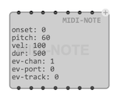
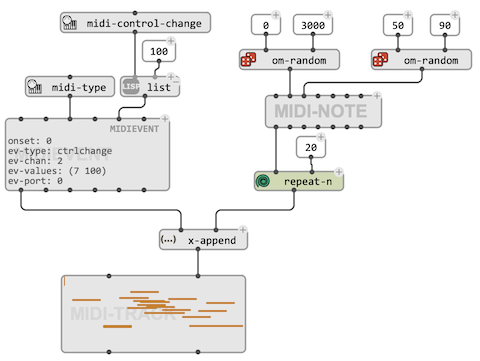
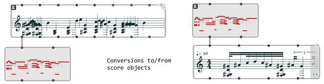
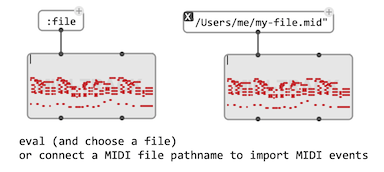

# `MIDI-TRACK`

The class `MIDI-TRACK` is a container for MIDI events. It contains a sequence of objects of type `MIDI-NOTE` or `MIDIEVENT`. 

> ### The class `MIDINOTE`
> 
> `MIDI-NOTE` extends the [`MIDIEVENT`](midi-events) with a number of attributes which make it easier to process in maniuplate with `MIDI-TRACKs`. In addition the the usual MIDI attributes, `MIDINOTE` has dedicated slots for `pitch`, `vel`, and `dur`. Internally these are converted to `MIDIEVENTs` of type `KeyOn`and `KeyOff`.

## Create a `MIDI-TRACK`

`MIDI-TRACK` can be initialized either by connecting a list of `MIDIEVENT` and/or `MIDI-NOTE` to the `midi-events` input slot, or by connecting a compatible object on the `self` input (first input) for automatic conversion.

 

> **Note:** Other MIDI events than notes are signified by small rectangles at the top of the miniview and editor displays, but are not editable.

 

A MIDI file can be loaded by connecting a **[pathname](file-io)** to `self`. If the value of `self` is **:file**, then the evaluation of the `MIDI-TRACK` box will open a file-chooser dialog for loading a MIDI file. 

 

> ### Compatibility
> 
> `MIDI-TRACK` corresponds, and extends the features of the **`MIDIFILE`** class in OpenMusic. The difference from OM's `MIDIFILE`, is that the `MIDI-TRACK` is not attached to a file and actually contains/internally stores the data as list of MIDI events.
> 
> Loading an OM patch containing a **MIDIFILE** will automatically convert it into a `MIDI-TRACK`, however, the `self` input might need to be set to **:file** and/or the file contents reloaded to obtain the exact same configuration.

## Editor

The editor of `MIDI-TRACK` displays and allows editing `MIDI-NOTE`s as a "piano-roll" representation. 
Transpositions, time and duration edits, note addition or removal are allowed and performed with the usual commands, as well as playback, zoom-in and -out, and other time modifications using the [timeline](time-sequence) editor option.

 

## Collections

The `MIDI-TRACK` editor supports integration in the [`COLLECTION`](store-collect#collection) editor, where several `MIDI-TRACK` objects can be visualized and played.

