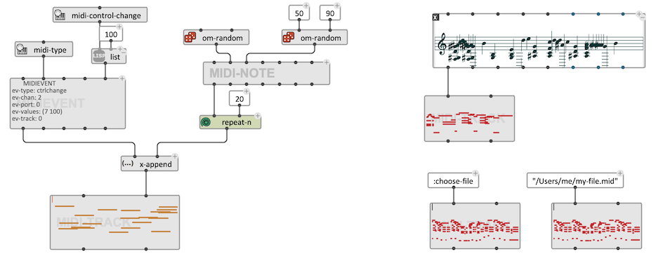
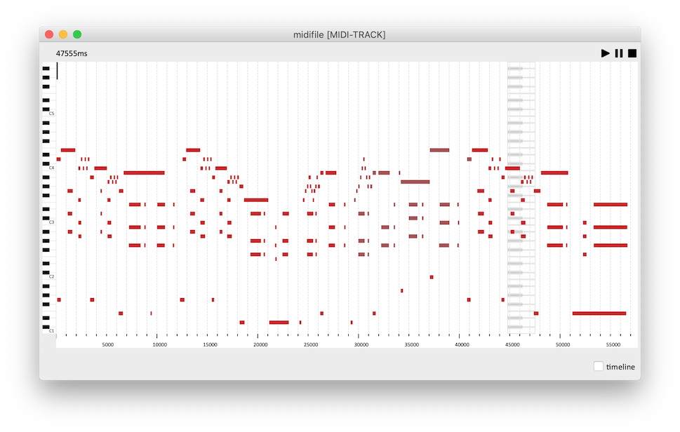
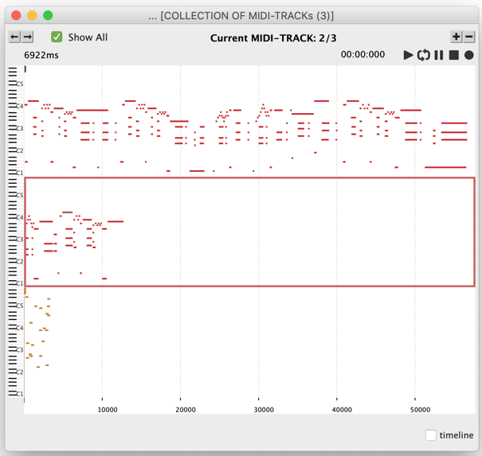

# `MIDI-TRACK`

The class `MIDI-TRACK` is a container for MIDI events. It contains a sequence of objects of type `MIDI-NOTE` or `MIDIEVENT`. 

## Initialization

`MIDI-TRACK` can be initialized either by connecting a list of `MIDIEVENT`s / `MIDI-NOTE`s to the `midi-events` input, or by connecting a compatible object on the `self` input for automatic conversion.

A MIDI file can be loaded by just connecting a **[pathname](file-io)** to `self` (first input). If the value of `self` is **:choose-file**, then the evaluation of the `MIDI-TRACK` box will open a file-chooser dialog for loading a MIDI file. 

 

> ### Compatibility
> 
> `MIDI-TRACK` corresponds, and extends the features of the **MIDIFILE** class in OM. The difference from a MIDIFILE, is that the `MIDI-TRACK` is not attached to a file and actually contains/internally stores the list of MIDI events.
> 
> Loading an OM patch containing a **MIDIFILE** will automatically convert it into a `MIDI-TRACK`, however, the `self` input might need to be set to **:choose-file** and/or the file contents reloaded to obtain the exact same configuration.

## Editor

The editor of `MIDI-TRACK` displays and allows editing of the internal `MIDI-NOTE`s as a "piano-roll" representation. 
Transpositions, time and duration edits, note addition or removal are allowed and performed with the usual commands, as well as playback, zoom-in and -out, and (timeline-editor) modifications.

 

## Collections

The `MIDI-TRACK` editor supports integration in the [`COLLECTION`](store-collect#collection) editor, where several `MIDI-TRACK` objects can be visualized and played.

