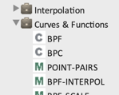
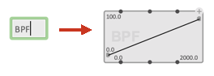
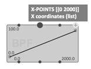
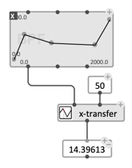
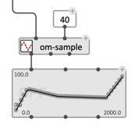
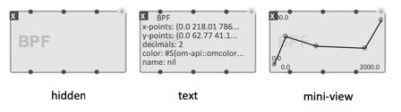
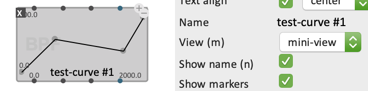
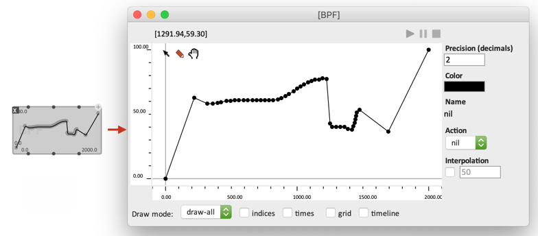
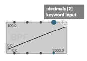
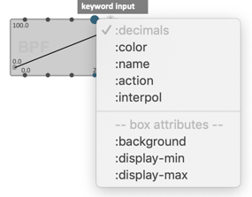

# Object Box

_Object_, or _"Class" Boxes_ generate and process data structures in OM# visual programs.

> In **object-oriented programming** (OOP), a _class_ is a template structure defining a **type** of data, its attributes (also called _slots_) and behaviours. From a defined class are be derived _instances_ of this class.
> An object box in OM can actually refer to the OOP concept of "factory": its main role is to produce (and additionally, to store/display/edit) instances of a given class.

The available classes or objects available in OM# are listed along with [functions](function-box) in the "Boxes/Add Box" menu, in the "Packages" of the [Session window](session#the-packages-library-tab), in the [Class/Function Reference](help), etc. Most of them are also listed in [these pages](index#main-objects-and-editors).

> 
> ___&rarr; Let us take the example of one of the basic OM# objects, the `BPF` (break-point function)___

In order to create an object box, select the corresponding _class_ from the "Boxes/Add Box" menu or in the "Packages" of the [Session window](session#the-packages-library-tab), or just type the class name in a new entry filed (double-click or type <kbd>N</kbd> on the main [patch editor view](patch)).

## Box

The object box generally has several inputs and the same number of outputs.

* **Inputs are arguments of the constructors**: they are the attributes or parameters used to build an instance of the class.

* **Outputs are accessors** to read or access these attributes.

_The BPF class has 2 main constructor arguments. `x-points` and `y-points`._

> ### The "self" input/output
> The first input/output of an object box, generally labeled ***"self"***, is a special one. It corresponds to the actual instance that is created, and allows accesssing it as such (_self_ output), or creating it by copying or conversion from an other object (when such conversion is possible). See examples below.
>
> The function `x-transfer` uses a `BPF` object as its first argument: we can get it using the **self** output of a `BPF` box:
>
> 
>
> The function `om-sample` returns a `BPF` instance: we can input and display/store in in a `BPF` box using the **self** input:
>
> 

## Persistence

Object boxes store and display the last computed instance, until a new evaluation replaces it.

The value is also stored and reloaded within the patch.

## Visualization

Object boxes generally have visualization modes, which can be selected from the [inspector view](inspector) or using the <kbd>M</kbd> key.

* **hidden**: the contents is hidden / the box only displays its reference class name (and possibly its name — see below).
* **text**: displays the contents of the visible class _slots_ as text.
* **mini-view** (when implemented for a given object): a graphical preview of the current value.

## Name

Object boxes can be given a name independently of the class name. This is useful to document the role of some data in a process (e.g. "initial value") or to label stored data or results.

The name can be set and changed in the [inspector view](inspector). It can also be set to be visible or not using the <kbd>N</kbd> shortcut.

## Editor

Most in-built OM# classes have an associated editor, which opens by double-clicking the box.

The editor allows visualizing, and generally, to editing/modifying the current value.

> ### Lock
> The [lock mechanism](eval-modes#lock-state) \| <kbd>B</kbd> is very important when working with object boxes in OM#, especially those associated with an editor.
> If some editing is performed on the current value of the box (in the editor) the box gets automatically locked, so as not to reinitialize and loose the edits at the next box evaluation.

## Additional/optional inputs/outputs

When a class has numerous slots/attributes and/or when all of them are not fundamental or necessarily useful, the box can displays them as [optional/keyword inputs](box-inputs#optional).

_– `decimals` is an optional additional argument of the BPF constructor._

## Box attributes inputs

Box "attributes" are related to the box or editor display or behaviour, independently of the constructed value.

> &rarr; In addition to the constructor arguments, this menu can also contain **"box attributes"**, which will set or transfer some general visualization or editing parameters of the editor through the box inputs/output.

_– The BPF editor has some visualization settings available though the "box attributes" inputs._

> **Note:** When set [reactive](reactive) (as defaults when a box-attribute input is added), the box-attribute inputs are evaluated and applied to the box even when the box is locked.
