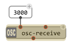
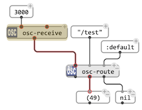
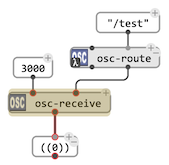
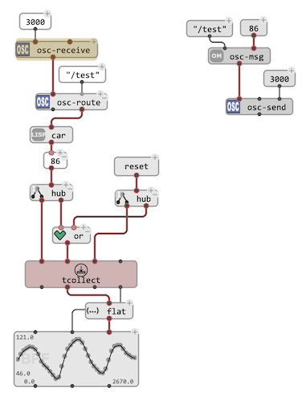
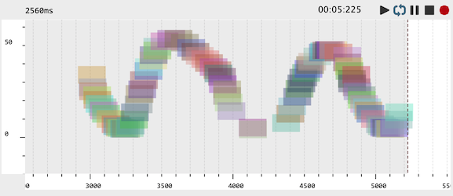

# Receiving OSC

## `osc-receive`

The main function to receive OSC messages in OM# is `osc-receive`.

`osc-receive` is a specal "receiver box": when set [reactive](reactive) (with <kbd>R</kbd> or using the right/<kbd>Ctrl</kbd>-click context menu) it starts an UDP server thread bound to a given **port** (given as first parameter) and delivers the received messages on its output. 

&rarr; The box frame gets colored while the receiving process is running.    
&rarr; Use the same <kbd>R</kbd> shortcut or context menu to stop the OSC receive process.

> **Notes:** 
> - If left `NIL`, the receive port value is taken from the OSC preferences.
> - This chosen port shouldn't already be in use anywhere (in OM# or in any other application running on the host). If a server is already running on this port in OM# (e.g. another receiver box or a recording editor), it will be proposed to abort the process before to run the new server. If a server is running in another application, an error might be raised. 
> - **`osc-receive` needs to be turned off and on again if an error occurs during the propagation of an incoming event.**

Since the receive box is set reactive, any incoming OSC message can be propagated through a chain of reactive updates. 

## Routing OSC

Similar to [`route`](reactive#routing-data), the `osc-route` box can be used to parse OSC addresses and orient the received data in visual programs.
`osc-route` has unlimited [optional inputs](box-inputs#optional) which should be connected each to an OSC address. If the box output connections are [reactive](reactive), notifications will be send for matching/non-NIL outputs. 
(The input(s) left with :default will output value only if no addres matches.)
Otherwise (and in any case) all messages also go throught the first ouput of the box. 

## Message pre-processing

The second input of `osc-receive` (`msg-processing`) is a [lambda patch or a lambda function](lambda) called with each received OSC message or bundle before to deliver it to the box output. Only non-NIL delovered values will be set and propagated through the `osc-receive` box output.

## Collecting

OSC messages pushed through `osc-receive` can be collected using the [`collect`](memory#collect)/[`tcollect`](memory#tcollect) utilities.

> &rarr; See [Memory](memory).

## Recording

The [`DATA-TRACK`](data-track) editor can record OSC bundles. When the record button is on, receiving starts on the input port defined in the OSC preferences. 
While playing or looping through the `DATA-TRACK`, received OSC messages will be set as new [`OSC-BUNDLE`](osc#a-data-frame) objects at the corresponding time. 

