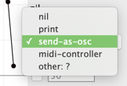
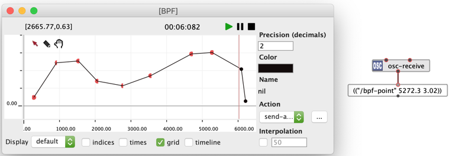

# Sending OSC

## `osc-send`

The main function to send OSC messages in OM# is `osc-send`.

`osc-send` can send:
- An OSC message formatted as a list `("/address" value1 value2 ...)`
- A list of OSC messages
- An `OSC-BUNDLE` object

&rarr; See also [OSC Messages and Bundles](osc)

The message is sent to the IP address specified in the second input (by default, set to `"localhost"` -- IP: `127.0.0.1`), and to the UDP port specified as third parameter.

## Sending OSC when playing objects

`osc-send` can be set as the action to [play](player) certain types of objects (e.g. BPF, BPC, 3DC...).

Two options are generally possible:

- Set lambda patch/function, or a function name as the "action", and include `osc-send` in the function:

 &rarr; 

- When available, select `send-as-osc` as predefined action:

 

> **Play!**   
>     
>
> &rarr; See: ["Actions" in the BPF page](bpf#actions).

## Playing `OSC-BUNDLE` objects

When [used in a `DATA-TRACK` container](osc#a-data-frame), `OSC-BUNDLE` OSC-sends its contents through UDP as default action.

The target IP address and port are specified in the [General Preferences](preferences).

