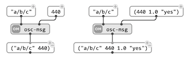
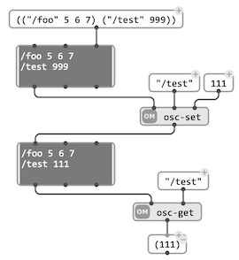
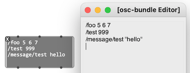
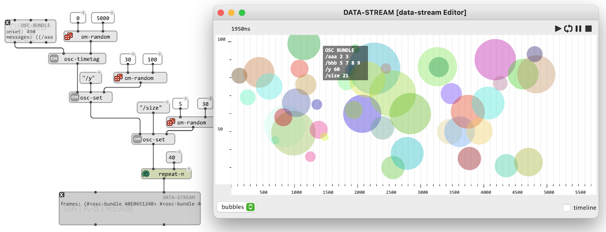

# OSC Messages and Bundles

An OSC message consists of an OSC "Address Pattern" followed by an by zero or more OSC "Arguments".

> What follows is a simplified description of OSC features and specification, corresponding to the minimum required to work with OSC in OM#. For a more detailed description, see [https://opensoundcontrol.stanford.edu/spec-1_0.html](https://opensoundcontrol.stanford.edu/spec-1_0.html).

#### OSC address patterns

The address pattern is a simple string following the syntax of URLs, begining with "/", usually describing a given parameter.    
For intance: `"/synth/parameters/frequency"`.

#### OSC arguments

OSC arguments can be integers, float numbers, strings. Some OSC implementations support additional types. 

>  
> &rarr; The function `osc-msg` is a simple utility to format OSC messages in OM#; but the messages can also be created and processed as plain Lisp lists: `("/synth/parameters/frequency" 440.0)`

## `OSC-BUNDLE`

The `OSC-BUNDLE` [object](objects) represents a set of OSC messages (optionally assigned to a give _date_). This structure reflects the notion of [bundle](https://opensoundcontrol.stanford.edu/spec-1_0.html#osc-bundles) in OSC specifications, and is encoded as an OSC bundle with the corresponding "time-tag" when [sent over the network](osc-out).

### Manipulating and processing OSC bundles

`OSC-BUNDLE` can be processed through OM# visual programs thanks to a number of utilities (see `osc-get`, `osc-set`, `osc-delete`, ...) or directly by maniuplating the list of OSC messages as a list of lists -- each message is a list `(address value(s))`.

 

A simple editor (accessible by doublick on the `OSC-BUNDLE` box) allows editing the contents of the message list directly as text.

 

### A `DATA-FRAME`

`OSC-BUNDLE` is a special type (sub-class) of `DATA-FRAME`. The `date` attribute (milliseconds) can be set to construct temporal sequences of OSC messages and embedded in containers such as [`DATA-TRACK`](data-track).

> `OSC-BUNDLE` has some specific properties set with the `DATA-TRACK` editor. The bundle display can be controlled with messages such as `"/size"`, `"/y"`, `"/color"`.

 

When played in such [time-sequences](time-sequence), the action of an `OSC-BUNDLE` is a call to [`send-osc`](osc-send), which sends the contents of the OSC bundle out through the network.
