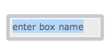

# Patch editor: Basics of visual programming
 
_This page describes the main features and manipulations allowing to create, configure and connect boxes in visual programs. It points to the other sections of this documentation for details on every specific features._

------

 
> Everything starts in the **patch editor**. Use the "File" menu to create a new patch, or open an existing patch, and display it in the patch editor window.

The different options in the "File" menu are:

- "New" to open a new patch ( <kbd>Ctrl/⌘</kbd>+<kbd>N</kbd> ) or other type of OM# document,
- "Open" / <kbd>Ctrl/⌘</kbd>+<kbd>O</kbd> allows you to choose an existing document to open,
- "Open Recent..." to retrieve most-recently opened documents,
- "Open Folder..." ( <kbd>Ctrl/⌘</kbd>+<kbd>shift</kbd>+<kbd>O</kbd> ) open all the OM#-compatible files that are inside a given directory.

> &rarr; See [More on Document Management](doc-management)

The "new" patch is an empty white page, ready for you to fill-in. 
You will have to add [boxes](#boxes) and [connect](#connections) them, in order to create visual programs.

 

> The patch editor has an optional **side panel** on the right, which opens with the buttons    on the right-border of the window (or corresponding commands and short-cuts in the "Edit" menu), in order to display:
> - The [Listener output](listener)
> - The [contents Inspector](inspector)
> - The [patch-to-Lisp conversions](lisp#getting-the-equivalent-lisp-code-of-a-patch)  

------

## Boxes

A box is a rectangular frame displaying a name (generally, the name of the function, object or embedded component it is referring to), an icon (sometimes) and a number of inlets and outlets.
**Inlets** (at the top) represent inputs of the function call. They corresponds to the _arguments_ of a [function box](function-box) or embedded [sub-patch](abstraction), or the _attributes_ of an [object constructor](objects).
**Outlets** represent the returned value(s).

**To create a box:**

- 
 Type <kbd>N</kbd> or double click anywhere on the patch editor background to create a function or object box. 
In the temporary text-input field, type a [simple value](value-box), or the name of the object you wish to add in the patch, then press <kbd>ENTER</kbd>.

- Use the **"Boxes/Add Box..." menu** of the patch editor window: just select a box name, then click somewhere in the patch editor.

- Use the _Packages Library_ tab of the main [Session window](session) [ <kbd>Ctrl/⌘</kbd>+<kbd>shift</kbd>+<kbd>W</kbd> ], to also double-click in a function or class icon, and then add it somewhere in the patch editor. 

> **Any Lisp function can be used** in a patch editor. 
However, only a subset of specific/documented functions declared in OM packages are visible in the function library.  

 
**Box inputs** allow to enter arguments/attribute/parameters to OM# boxes. 
Their value can be set "by hand" by just clicking on the input and typing a simple value, or through connections to other boxes (see below).

**Documentation:** 
Use the menu "Help/Help Function & Class Reference" or the the <kbd>Ctrl/⌘</kbd>+<kbd>D</kbd> shortcut to open an auto-generated HTML reference documentation page of a box.

> &rarr; See [this page dedicated to box boxes](box).

------

## Connections

In order to create a connection, use the mouse to drag from a box output to another box input.
If the connection is allowed (for instance, cycles are not permitted and inconsistent with the visual language semantics), the connection line will appear in the patch.

 

Existing connections can be selected with the mouse, re-routed (e.g. for readability) with "mouse drag", re-connected somewhere else, or deleted (using the <kbd>backspace</kbd> key).

> &rarr; See the [dedicated page about Connections](connections). 

------

## Edits

> ### Undo/Redo
>
> Use the standard <kbd>Ctrl/⌘</kbd>+<kbd>Z</kbd> / <kbd>Ctrl/⌘</kbd>+<kbd>shift</kbd>+<kbd>Z</kbd> in order to undo/redo your last editing operations.

### Move

Patch contents (boxes and connections) can be dragged on the patch editor, and/or from one editor window to another.

Alternatively, the arrow keys <kbd>←</kbd> <kbd>→</kbd> <kbd>↑</kbd> <kbd>↓</kbd> also move selected boxes.     
<kbd>shift</kbd> + <kbd>←</kbd> <kbd>→</kbd> <kbd>↑</kbd> <kbd>↓</kbd> performs faster moves.

### Delete

Deleted selected contents using the <kbd>backspace</kbd> key.

### Copy-Cut-Paste

- The "Edit" menu provides the standard Copy / Cut / Paste commands.

- Boxes can also be copied and pasted using the standard OS-specific drag&drop combinations: <kbd>alt</kbd> + _drag&drop_ on macOS, <kbd>Ctrl</kbd> + _drag&drop_ on Windows/Linux.

All these operations can be performed on the same editor window, or from one editor window to another.

### Select All

The "Edit/Select all..." menu command / <kbd>Ctrl/⌘</kbd>+<kbd>A</kbd> selects everything in the patch window.

### Align

- The "Edit/Align Boxes" menu command, or <kbd>shift</kbd>+<kbd>A</kbd> key-combination,  automatically adjust the box layout to align positions of neighbour boxes and inputs vs. outputs. 

> &rarr; See other commands in the [Boxes](box) section.

------

## Evaluation

A patch is executed locally by the [evaluation](eval) request / <kbd>V</kbd> of a box, which computes the value of this box and of all required, upstream connected boxes.

------

## Lock 
The icons   at the top of the patch window, or the menu "Edit/Edit lock" [ <kbd>Ctrl/⌘</kbd> + <kbd>E</kbd> ] allow you **lock/unlock** the patch editor.
In the lock mode:
- The patch can not be edited (most commands described in this page are disabled)
- Boxes can be [evaluated](eval)
- The [interface box](interface-boxes) and [value boxes](value-box) are reactive to simple mouse-clicks.

