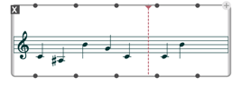
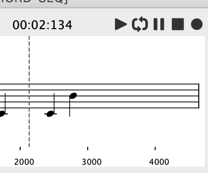
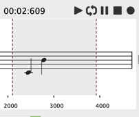
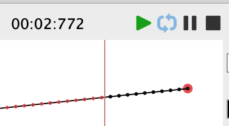

# Player

All playable objects can be rendered from the containing object box using the <kbd>Space</kbd> bar (<kbd>s</kbd> can also be used to _stop_ playing).

 

Playing has a different effect depending on the objects:

- [`SOUND`](sound), [`MIDI-TRACK`](midi-track), and all score objects have specific audio / MIDI rendering.
- [`DATA-TRACK`](data-track) has specific actions depending on the contained data: `MIDI-EVENT` also plays as MIDI, `OSC-BUNDLE` sends OSC data...
- Other playable objects (like [`BPF`](bpf), [`BPC`](bpc), [`3DC`](3DC)...) have [customizable actions](bpf#actions).

> The [Sequencer](sequencer) allows arranging and playing all types of objects together.

When they have an editor, they cal also be played using dedicated transport controls, generally situated at the top of the editor.

 

The start marker for the player inside the object editor can be set by double-clicking anywhere on a time-graduated view – either the main editor view, or the [timeline view](time-sequence#timeline-editor), when relevant.

Use <kbd>Esc</kbd> to reset the start marker at the beginning (time = 0).

 

A time-interval can be set by dragging begin and end markers starting from this initial start marker. 
The player will start and stop at these markers.

 

Use <kbd>Esc</kbd> to collapse the time-interval selection.

> ### Looping
> 
> The _loop_ toggle sets the player on loop mode, and repeats playback over the time interval selection (if any) or over the total duration of the played object.
>
>  
