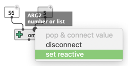
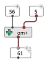
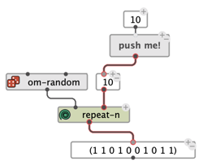
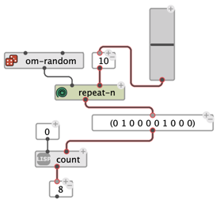
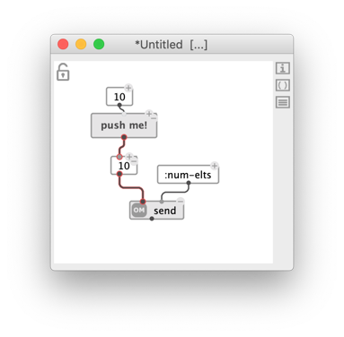
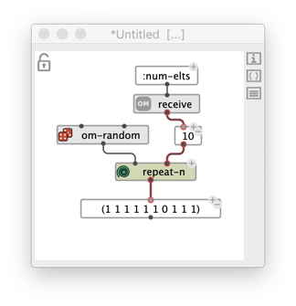
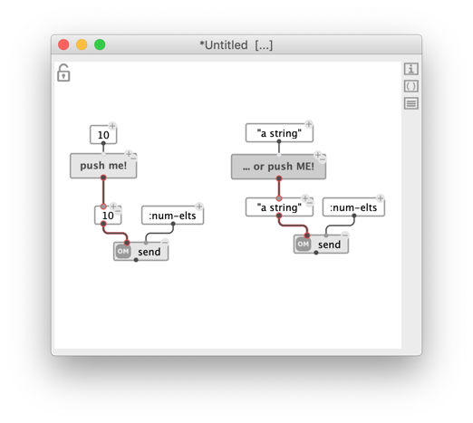
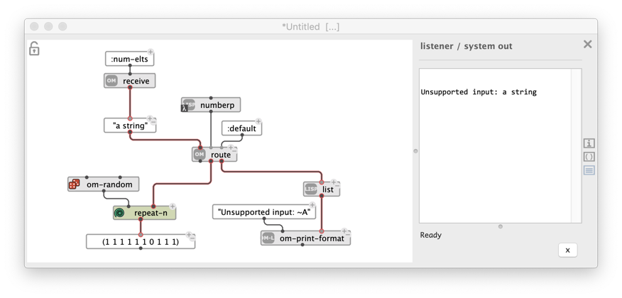
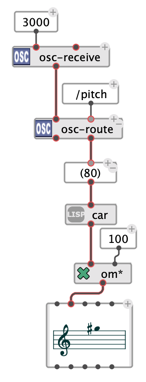

# Reactive processes

> The reactive mode enables interactive/real-time features in OM# visual programs. 

Reactivity can be set/unset: 

 
- At the level of a box input or output, using a contextual menu option ("set reactive"):

- At the level of a connection, using the "reactive" control of the inspector panel, or the <kbd>R</kbd> shortcut. This is equivalent to setting/unsetting the reactivity of the box input and of the box output at both sides of the connection.

- At the level of a box, also using the "reactive" control of the inspector panel, or the <kbd>R</kbd> shortcut. This is equivalent to to setting/unsetting the reactivity of all the inputs and outputs of this box at once.

 

&rarr; Reactive inputs, outputs and connections are displayed with a slight red border.

> **A reactive box propagates a notification to downstream reactive boxes when its value changes.**      
> This can happen for the different reasons:
> - The box is [evaluated](eval);
> - Edition in the graphical editors (for [object boxes](object-box) or in the text field (for [value boxes](value-box));
> - Modification of an [input value](box-inputs);
> - Action of an [interface box](interface-boxes) (e.g. slider, etc.);
> - External notification or update (e.g. MIDI/OSC receive boxes – see below).
>
> **A notified reactive box that has no downstream reactive connections reevaluates itself automatically.**
> 
> This process makes for visual programs (or portions of visual programs) to _react to changes_ in the environment, either triggered by user actions for by incoming messages from other software.
>
> _&rarr; In the simple patch displayed above, this means that if the value of the box `5` changes for any reason, the value of the result box `61` will be updated with a new result._

> **Note:** Reactivity applies to the "first-level" visual program, that is, not inside the sub-patches. Even if it contains reactive boxes, a sub-patch is always considered as an "atomic" function in the reactive context.

## Examples and applications

#### Interact with interface boxes

The [interface boxes](interface-boxes) provides plenty of opportunities to design interactive visual programs in OM#, which for the most part will make sense when used along with the reactive mode, in order to set an input value, change the routing of a patch, or trigger an actions.

   

#### Communicate internally: `send` / `receive`

The function `send` sets the value of any matching `receive` box present in the patches that are currently open in the OM# session. 

The message can be labeled in order to target a specific receiver, or a set of receivers, also initialized with that label.

Targeted `receive` boxes notify and update downstream reactive boxes.

   

#### Routing data

Data transferred through reactive program updates can be filtered and routed by the `route` box.

`route` has unlimited [optional inputs](box-inputs#optional) which also create a corresponding new ouputs on the box, and can be connected to different _tests_ (a test is a function or patch box in [lambda mode](lambda), or just a function name to apply). The data received on the first input will be propagated through the corresponding output if they comply with the test.

   

#### Communicate with the world

Data received from external applications through UDP/OSC or MIDI can update and trigger computing in OM# visual programs.

The `osc-receive` or `midi-in` boxe start a receiving server thread when activated with <kbd>R</kbd> (or with context menu, "Start receive"). This also turns these boxes reactive, so that incoming messages can be sent through a chain of reactive updates, and processed in visual programs. 

> See [Receiving MIDI](midi-in) / [Receiving OSC](osc-receive).
