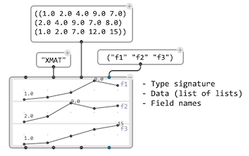
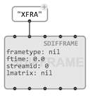
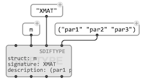
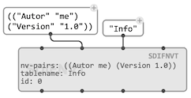

# SDIF Structures

OM# provides a the following classes representating elements of the [SDIF format structure](sdif-intro) in visual programs.

## `SDIFMATRIX`

`SDIFMATRIX` represent an SDIF [matrix](sdif-intro#matrices) (!). It has a matrix [type](sdif-intro#types) (string of 4 characters) and a list of list containing the description data. 

 `SDIFMATRIX` is actually a simple [`CLASS-ARRAY`](2d-array): it is your responsibility to fill it with the right amount of fields, and in the order corresponding to a given type description.

> Field names can be set with an optional, ["keyword" input](objects#additionaloptional-inputsoutputs). They are optional and used here only for display, since the matrix [type](sdif-intro#types) already defines them.

## `SDIFFRAME`

`SDIFFRAME` is a container for one or several `SDIFMATRIX` instances (connected to the `lmatrix` input). It has a frame [type](sdif-intro#types) (string of 4 characters), a [stream ID](sdif-intro#streams) and and a time tag.

> `SDIFFRAME` sequences can be stored and visualized as frames in a [`DATA-TRACK`](data-track) container.

## `SDIFTYPE`

> When creating an SDIF file, every new matrix or frame [type](sdif-intro#types) must be declared.

`SDIFTYPE` allows declaring [types](sdif-intro#types) when [writing SDIF files](sdif-write).

## `SDIFNVT`

[Name-Value Tables (NVT)](http://sdif.sourceforge.net/standard/sdif-standard.html#Informations%20Table) are general textual information stored in the SDIF file header, giving all kind of contextual information about the actual contents (author or source of the file, analysis methods and parameters, etc.)

`SDIFNVT` objects are used to [read](sdif-read#name-value-tables) or [write](sdif-write) NVTs in SDIF files.

