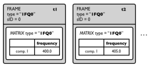
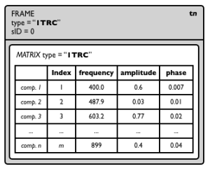
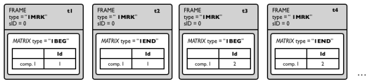

# Inroduction to SDIF

[SDIF (Sound Description Interchange Format)](http://sdif.sourceforge.net/) consists of a basic data format framework and an extensible set of standard sound descriptions.

> See also: [File format description in the SDIF website](http://sdif.sourceforge.net/standard/sdif-standard.html).


## Important concepts


### Frames

SDIF data is encoded as a sequence of time-tagged **frames**. Each frame has a header, including a time, a "stream ID" and a "type signature" (a string of 4 characters) which provides information about its contents.

The actual data is stored as a set of one or more **matrices**.

### Matrices

SDIF matrices are bi-dimentional structures describing the sound (or anything else!) with a number of parameter (called "fields") at a given moment in time.

An SDIF matrix also has a header including a type signature (also a string of 4 characters) which provides information about the matrix contents, and some internal information about the matrix size.

- The columns of SDIF matrices are called **fields**: they correspond to the different parameters of a given description.
- The lines  of SDIF matrices are called **components**. While there is a fixed number of fields in a matrix, there can be any number of components.

> For instance, "sinusoidal tracks" matrices (type `"1TRC"`) have 4 fields describing partials : index, frequency, amplitude, phase. They have as many components as the number of active tracks (or "partials") at a given point in time.


### Types

[SDIF specifications](http://sdif.sourceforge.net/standard/types-main.html) define a number of standard frame and matrix type signatures and descriptions, for instance `"1TRC"` (sinusoidal tracks, used for "additive" sinusoidal sound descriptions), `"1MRK"` (markers), `"1FQ0"` (fudamental frequency), `"1ENV"` (spectral envelope) etc. (see [below](#examples-of-common-standard-sdif-descriptions)).

SDIF types can also be declared locally in the SDIF file header. 

- Frame type descriptions contain a list matrix types that are expected (and allowed) to be contained in a frame of this type.
- Matrix type descriptions contain a list of field names that are expected in a matrix of this type.

> **Notes:**
> - Every frame and matrix in the SDIF file must be of a "known" type, either declared in the standard or in the file header.
> - Standard SDIF types' first character is usually a version number (most often, `"1"`), while experimental types start by convention with `"X"`.
> - It can happen (and often happens!) that a frame and matrix type have the same signature. 
> - It is possible to re-declare and override existing SDIF type declarations, for instance to add fields in a given matrix type, or to add more matrices in a frame type.

### Streams

The "stream ID" (sometimes abbreviated `sID`) allows segregating parallel frame streams within the data contained in an SDIF file. These can be different descriptions of a given sound, description of different channels or parallel audio tracks, etc. This information is important to consider when [extracting data](sdif-read) from an SDIF file.


## Examples of Common Standard SDIF Descriptions

_The following examples and illustrations are borrowed from the <a href="https://support.ircam.fr/docs/om/om6-manual/co/SDIF-Intro.html" target=_blank>OpenMusic documentation</a>._

### Fundamental Frequency



The fundamental frequency estimation is a single-dimension data: the matrix (type signature: `"1FQ0"`) has one field (the frequency) and one component (one value for the frequency at each point in time).

The type declaration of the matrix can be:
```
1FQ0 { frequency }
```

Sometimes the fundamental frequency description also involves additional parameters. Therefore the actual standard matrix type definition is extended as:
```
1FQ0 { frequency, confidence, score, realamplitude }
```

The frame type signature is also `"1FQ0"`. `1FQ0` frames only contain one matrix of type `1FQ0`. The frame type declaration is therefore:

```
1FQ0 { 1FQ0 FundamentalFrequencyEstimate }
```


### Partials



Partials (sinusoidal tracks) are described by sequences of SDIF frames of type `"1TRC"`. 
Each partial is identified by an index, and within each frame, the parameters of each partial active at the corresponding time are described by matrices, also of type `"1TRC"` (and an arbitrary number of partials can de stored in every matrix).

The standard matrix type definition is:
```
1TRC { index, frequency, amplitude, phase }
```

The frame type declaration is:
```
1TRC { 1TRC SinusoidalTracks}
```

> **Note: Harmonic Partials** (multiples of a fundamental frequency) are stored like partials but have a dedicated in frames and matrices types `"1HRM"` in the SDIF standard.

### Markers

Simple markers are stored in frames of type `"1MRK"`.

It is often the case that markers embed additional data and information. For instance transient detection markers differentiate begin and end of the transients. They can also include additional info, such as labels, confidence scores etc. 
"Begin marker" frames contain matrices of type `"1BEG"`, while "end marker" framess contain matrices of type `"1END"`.



### Chord-Sequences


"Chord-Sequence analyses" are not straightforward to embed in SDIF, since they are closer to "symbolic" (MIDI-like) data than actual time functions. They can however be stored efficiently using markers and `1MRK` frames.

Following the model of the SDIF partials, each "note" is identified by a unique ID. The marker frames will then contain, at a given time:

- `1BEG` matrices containing the ID of the notes beginning at this time.
- `1TRC` matrices containing the value of the different parameters of the notes begining at this time.
- `1END` matrices containing the ID of the notes ending at this time.
