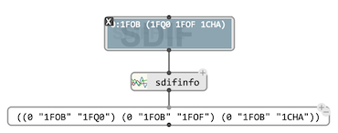
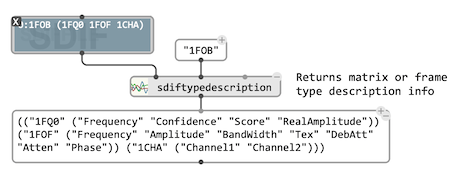
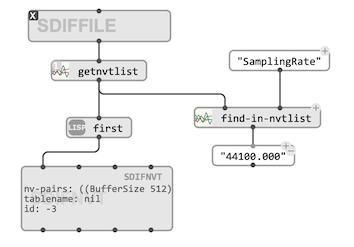

# Reading SDIF meta-data

Extracting data from an SDIF file generally requires information about its structure and contents.
The [SDIF file editor](sdiffile#editor) is a useful means to get such information, although other utilities are also available for it.
It is important to identify in particular, whether the targeted data is in a specific [stream](sdif-intro#streams), and if it corresponds to a given [type](sdif-intro#types) of SDIF frame or matrix.

### Frame/Matrix Stream structure

The `sdifinfo` utility returns a list of "matrix streams". In SDIF ["streams"](sdif-intro#streams) are determined by the type and stream ID of a sequence of [frames](sdif-intro#frames). Here, "matrix stream" means that two different [matrix]((sdif-intro#matrices)) types contained in a same frame stream will be reported as different elements. The mqtrix streqm info returned by `sdiffinfo`are therefore triplets `(stream-ID, frame-type, matrix-type)`:

`sdifinfo` also prints a more detailed description in the [Listener](listener).

> Note that this information aslo appears on the [`SDIFFILE` box](sdiffile#box) mini-view.

### Type descriptions

`sdiftypedescription` is another utility reading the  description of matrices or frames of a given type in the SDIF file [type declarations](sdif-intro#types).

### Name-Value Tables

[Name-Value Tables (NVT)](http://sdif.sourceforge.net/standard/sdif-standard.html#Informations%20Table) are general textual information stored in the SDIF file header, giving all kind of contextual information about the actual contents (author or source of the file, analysis methods and parameters, etc.)

The SDIF package of OM# includes a class [`SDIFNVT`](sdif-classes#sdifnvt) representing this information. 

The function `getnvtlist` returns all Name-Value Tables found in an SDIF file as a list of `SDIFNVT` objects.
The utilities `find-in-nvt` and `find-in-nvtlist` facilitate searching specific information in it.

