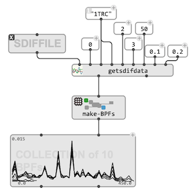
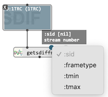
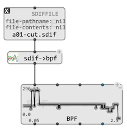
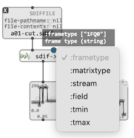
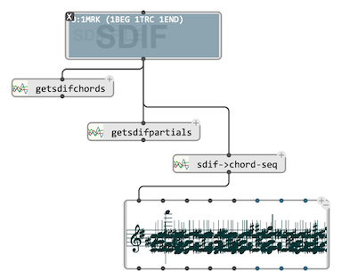
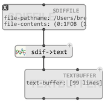

# Reading SDIF data

The main function to extract SDIF data is `getsdifdata`. Using information gathered about the contents of the file, this function can be parameterized with [optional/keyword inputs](box-inputs#keyword) to target specific [streams](sdif-intro#streams), frames, matrices, and eventually fields or ranges of data within a given matrix.

## As `SDIFFRAME` objects

`getsdifframes` returns a list of [`SDIFFRAME`](sdif-classes#sdifframe) objects. The optional function parameters allow to target specific [streams](sdif-intro#streams), frame [types](sdif-intro#types) of time ranges.

> [`SDIFFRAME`](sdif-classes#sdifframe) objects can be further processed in OM# programs, [written in new SDIF files](sdif-write) or used/visualized in a [`DATA-TRACK`](data-track) container.

## Direct conversion tools

Some utility functions facilitate the reading and conversion of the most common types of SDIF data.

### BPF

`sdif->bpf` converts a targeted field in a stream of frames and matrices into a BPF object. This is usually adapted and useful when the matrix has one dimension (one single value per field). 

By default, the function looks for [fundamental frequency data](sdif-intro#fundamental-frequency), but all parameters can be set via [optional/keyword inputs](box-inputs#keyword) and adjusted to read other or more tragetted values.

### Markers

`sdif->markers` returns a simple list of times. Here again the function defaults to a specific type of data (the [frames of type `"1MRK"`](sdif-intro#markers) and regardless of the matrix types), but more specific info can be targeted using the box [additional inputs](box-inputs#keyword).

### Partials and chords

The most frequent use of SDIF data in OM# is to import [spectral analyses](sdif-intro#partials) and process it as symbolic data. A number of utilities perform this conversion with different degrees of precsion and abstraction:

- `getsdifpartials` returns the more accurate data formatted as `partial` structures.
- `getsdifchords` formats the information a a list of "notes": a list of pitch (Hz), onset (seconds), duration (seconds), velocity (linear).
- `sdif->chord-seq` returns a [`CHORD-SEQ`](chord-seq) object with pitches rounded to midicents, velocities to [0-127], and timing in rounded milliseconds. 

All these functions apply to frames of type `"1TRC"`, or `"1HRM"` / `"1MRK"` when they contain `"1TRC"` matrices (["chord-seq analysis"](sdif-intro#chord-sequences)).

## SDIF to Text

The SDIF to text conversion utility is an alternative to the SDIF editor for getting an exhaustive view of both the meta data and contents of the file.

`sdif->text` writes a file on the disk, by default located next to the SDIF file and with teh same name (and the ".txt" extension). It returns the path to this file, in such a way that it is possible to simply connect it to a [`TEXTBUFFER`](textbuffer) object.