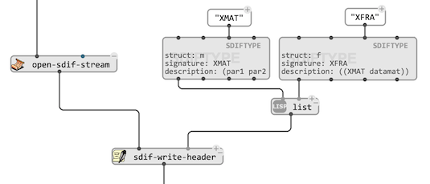

# Writing SDIF files

## General

`write-sdif-file` allows writing a list of time-tagged [`SDIFFRAME`](sdif-classes#sdifframe) objects into a new file.

> The [SIDF types](sdif-intro#types) of every frame, and of every matrix in the frames must be either in the SDIF standard types, or declared with the `types` [input](box-inputs#keyword) with a list of [`SDIFTYPE`](sdif-classes#sdiftype) objects.

> Name-value tables containing meta-data can also be included to the file with [`SDIFNVT`](sdif-classes#sdifnvt) objects connected to the `nvts` [input](box-inputs#keyword).

## Incrementally, using a file-stream

Similar to [`open-file-stream`](file-io#advanced-control-over-file-readingwriting-operations), `open-SDIF-stream` opens and returns a “stream” to a file (designated using a pathname), which can be used to incrementally write SDIF data.

Before anything, it is necessary to write the SDIF file header with `sdif-write-header`. Optional inputs options allow declaring SDIF [types](sdif-info#types), [name-value tables](http://sdif.sourceforge.net/standard/sdif-standard.html#Informations%20Table), or [stream descriptors](http://sdif.sourceforge.net/standard/sdif-standard.html#Stream%20IDs%20Table):
- `types` : a list of[`SDIFTYPE`](sdif-classes#sdiftype) objects.
- `nvts` : a list of [`SDIFNVT`](sdif-classes#sdifnvt) objects.
- `sids` : a list of [stream](sdif-intro#streams) descriptors of the form `(ID name description)` where ID is a number (the stream ID), `name` is a string, and `descritpion` is a "tree" (also a string, describing the purpose or "target" of the data un URL-style, e.g. `"a/b/c"`).

Once the SDIF header is written, frames ([`SDIFFRAME`](sdif-classes#sdifframe) objects) can be added in the files one by one with `sdif-write-frame`.

> The "file stream" opened and returned by `open-SDIF-stream` can be closed with `close-SDIF-stream` when no more read or write operations need to be done to the file.

> &rarr; See also how to do this in a [loop](loop) in the See also the `sdif-write-loop` [help-patch](help).

## Saving specific objects and data as SDIF

As a complement to [dedicated file-reading tools](sdif-read#direct-conversion-tools), a number of dedicated functions help writing SDIF files from OM# objects:

- `bpf->sdif` saves a `BPF` object as SDIF. The type of frames/matrices can be specified (and declared if necessary) using additional inputs if the function.

> The `scope` parameter of `bpf->sdif` determines whether the x-dimension of the BPF should be considered as time (default) or as the elements in a single matrix.

- `chord-seq->sdif` saves a list of times [as `1MRK`/`1TRC` frames](sdif-intro#chord-sequences) in a new SDIF file.

- `markers->sdif` saves a list of times [as empty `1MRK` frames](sdif-intro#markers) in a new SDIF file.

> &rarr; See also the `sdif-write-objects` [help-patch](help).
