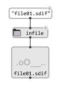
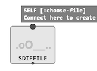
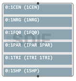
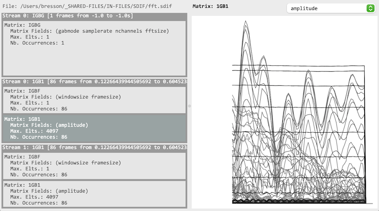

# The `SDIFFILE` object

`SDIFFILE` is a pointer to an [SDIF](sdif-intro) file in the patch.

## Box 

Load a file by connecting a valid SDIF file pathname to the box:

> **Notes:**
> - The `SDIFFILE` box can be connected directly to the output of another function box producing and SDIF file pathname. 
> - The box can be [locked](eval-modes#lock-state) (with <kbd>B</kbd>) once the file is loaded, if the file pointer should be stored permanently in the box.

If the `self` input is `:choose-file` (default value when not connected), a file-chooser dialog opens to select an SDIF file.

Once loaded, the box [mini-view](objects#visualization) displays an overview of the loaded file structure: the different SDIF frame [streams](sdif-intro#streams), and the different [types](sdif-intro#streams) of SDIF [matrices](sdif-intro#matrices) within each stream: 

## Editor

Double-click the `SDIFFILE` box to open and visualize the file contents in the SDIF file editor.

In the left panel, a detailed information about each [stream](sdif-intro#streams) is visible (number of frames, time range), with sub-stream differenciated for each matrix type withing a given frame stream, also printing information about content and occurences.

Clicking on a sub-stream selects it for visualization on the right panel.
A [matrix field](sdif-intro#matrices) must be selected using the chooser at the top-right, in order to plot the corresponding values.

> **Note:** It is not possible to edit the contents of the `SDIFFILE`! The SDIF editor is mainly intended to provide an overview of the file contents, in order to identify elements and parameters to use for extraction using other [SDIF tools](sdif-read).
> 