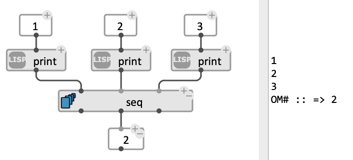
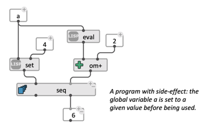
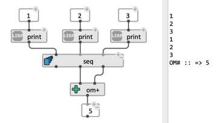

# Sequencing operations: `seq`

The `seq` box simply evaluates all its outputs in a specific order (from left to right) and returns results on corresponding outputs.  

Add/remove inputs and outputs using the `+`/ `-` buttons.

 

`seq` is close to what a simple `list` call would do with similar inputs, but only returns the required data. By involving evaluation of expressions not necessarily bound to return data, this box supports the creation of programs with "side-effect", as in [_imperative_ programming](https://en.wikipedia.org/wiki/Imperative_programming) style.

 

 
> **Note:** If several outputs are called, beware of multiple evaluation of the whole sequence, and consider using the [eval-once](eval-once) option. 

