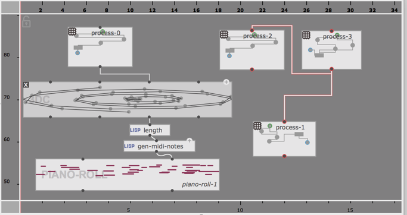
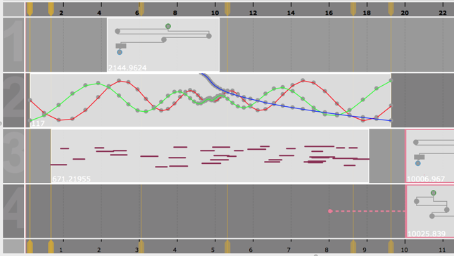
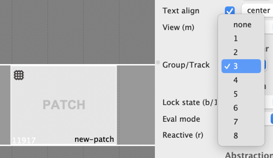
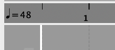
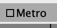
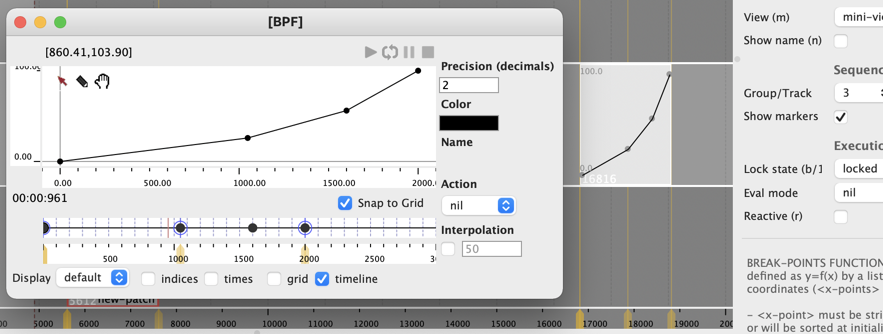
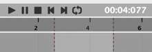

# Sequencer editor

A sequencer is a document containing boxes and connections.

The sequencer allows displaying this contents in two different ways.
Use  /  to switch display.

## "Maquette" view 

The "maquette" view displays all the boxes and their connections.

It works more or less like a [patch editor](patch), except that the position and size of the box are interpreted as time (from left to right), so that their contents can be arranged, and played.

In order to add or create boxes in the maquette view:
- Drag the box from a patch
- <kbd>Ctrl/⌘</kbd> + double-click on the view and enter a name
- Use the window or contextual menu

The maquette view has both a [horizontal/time ruler](#time-rulers) and a vertical ruler, which allow zooming and scrolling the view.

## Tracks view 

The "tracks" view arranges the sequencer contents on different tracks.

The when in "value" [display mode](patch-box#display), the **value** of each box (or its first output value, for [patches/abstraction boxes](patch-box) with several ouputs) is displayed proportinally to its real duration.

- The tracks view doesn't allow setting connections between boxes. &rarr; To do so, switch to maquette view.

- Boxes can only be added by drag-and-drop from other patches or sequencers, or with <kbd>Ctrl/⌘</kbd> + click (to create a new empty patch box).

- In a track, boxes can move only left and right (i.e., in time). However, boxes can also be dragged (or copy-pasted) up and down (i.e. from one track to another).

#### About tracks:

- The "Group/Track" property of a box corresponds to its track number. It changes when boxes are dragged to another track.

- The "Group/Track" property of a box can also be set from the [inspector/properties panel](inspector) (open with <kbd>Ctrl/⌘</kbd>+<kbd>I</kbd>).

- **Boxes that have "none" as Group/Track do not appear in the tracks view.**

> **&rarr; In order to increase the number of tracks, set the ID of a view to a higher value!**

## Evaluation

Boxes in the sequencer can be [evaluated](eval), anytime and anywhere, using the <kbd>V</kbd> key.
The box evaluation has the same semantics as in a patch: evaluating upstream-connected boxes, when relevant, and following connections (even when hidden by the "tracks" view).

The button  on the sequencer window reevaluates all the sequencer contents at once.

> See [Sequencer (Programming)](sequencer-programming) for more about evaluation in the sequencer.

## Time rulers

The time rulers above and below the sequencer views display time units, and allow navigating (click-and-drag horizontally, or using the "pan" gesture if supported by the operating system) and zooming in/out (click-and-drag vertically, or using the "zoom" gesture if supported by the operating system).

- The ruler at the top is a "metric rule": it displays time in beats (according to the specified tempo, and by default following a 4/4 meter).
- The ruler at the bottom displays time in milliseconds.

The "tempo" control next to the metric ruler allows changing the tempo of the metric ruler by clicking + dragging up/down.

> 
The "Metro" (metronome) check on the sequencer editor allows hearing the beats while playing back.

## Time markers (_tracks view_ mode)

In [_tracks_ view](#tracks-view-), the ["master points"](time-sequence#master-timed-items) found in [time-sequence](time-sequence) objects in the maquette can be displayed as "time markers" in the if the box has the "Show markers" option turned on.

Time markers make it possible to stretch the contents of time-sequences by moving master points from the sequencer editor.
They can also be synchronized (by just dragging them on top of each other) and used to synchronize internal events from different objects contained in the sequencer.

## Playback / rendering

The transport bar at the top of the sequencer editor controls the palyback of the sequencer contents.

The value of each box (or its first output value, for patches/abstraction boxes with several ouputs) is considered its "musical output" by the player.

Time intervals and loops can be set [as in other OM# playable editors](player).

> ### Reactive evaluation during playback
>
> **When a box in the sequencer is as at least one [reactive](reactive) output, it is also reevaluated when the play cursor reaches it**.
>
> In order to anticipate the calculation, a "pre-delay" (in milliseconds) can be assigned to every box.
>
> 
