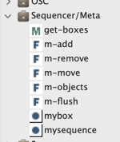

# Sequencer programming

As an extension of the [patch](patch), the [sequencer](sequencer) allows building programs and [evaluating](eval) anytime, and from anywhere.

- The <kbd>V</kbd> shortcut evaluates the selected boxes.

- The button  on the sequencer window reevaluates all the sequencer contents at once (every box and the "control patch" -- see below).

As a musical construction, the sequencer also offers other interesting programming features:

## Control patch: a reflective program

> _In computer science, reflective programming or reflection is the ability of a process to examine, introspect, and modify its own structure and behavior._ [[Wikipedia]](https://en.wikipedia.org/wiki/Reflective_programming)

The sequencer has a secondary "control patch" which allows controlling or generating its main contents.

&rarr; Use the  to open/close the control patch in the editor.

The control patch is evaluated when the [sequencer box](sequencer) is evaluated inside another patch, or when the sequencer is evaluated using the  button (see [Evaluation of the sequencer](#evaluation-of-the-sequencer)).

Its inputs/outputs correspond to the inlets/outlets of the [sequencer box](sequencer#sequencer-box): the sequencer can be parameterized or transfer any data to its own container program.

By default, the control patch returns the sequencer itself: the output is simply connected to a **`MYSEQUENCE`** box (see below):

Therefore the [sequencer box](sequencer) by default has one output returning the sequencer:

Anything can be programmed in this patch. 
In particular, utilities from the "Sequencer/Meta" package allow manipulating the contents of the sequencer (add box, remove box, move box, ...)

> _This control patch generates two boxes at random positions between 0 and 4000ms on tracks #1 and #2, each time the sequanncer is evaluated:_
> 

> #### Reactive updates (during playback).
> The control patch can also be partly reactive and receive commands for updating the maquette contents during playback, eventually sent by the boxes inside.
> See [Reactive Processes](reactive).

## Meta-visual programming with box properties

A patch box in a sequencer can access (and modify) information about its own containing box and context.

Two "special boxes" are of a particluar interest:

- **`MYBOX`** returns the box containing the patch. All its properties are accessible (size, color, name, position). The position is a particulraly interesting parameter, considering that the x/horizontal axis respresents the time of the resulting musical structure in the sequencer.

In order to query or set the box properties, use the [`SLOTS` box](slots#a-use-case-of-setting-slot) with the `OMBox` class.

> _In this example, PATCH-1 transposes a sequence of a given amount of midicents, corresponding to its own time/x-position:_       
> 

> _In this example, PATCH-2 always sets itself at the same time/x position as PATCH-1:_     
> 

> **Note:** **`MYBOX`** can also be used in a regular patch, outside of the sequencer context.

- **`MYSEQUENCE`** returns the containing sequence, and allows adding, removing, modifying or accessing all other boxes in this seqeunce (see the functions of the "Sequencer/Meta" package).

> _In this example, PATCH-3 steals the contents of an other box chosen randomly in the sequencer:_     
> 

