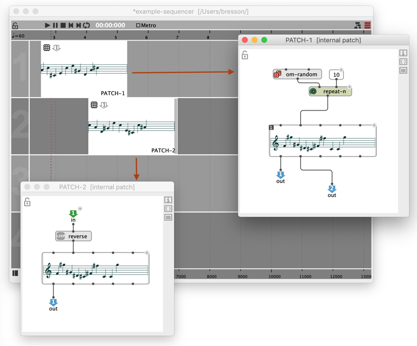
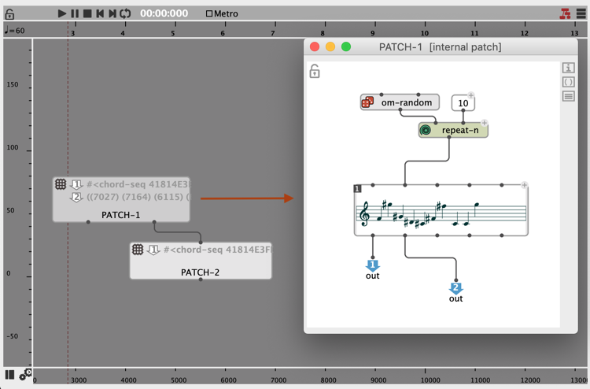
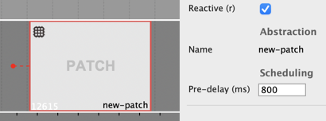
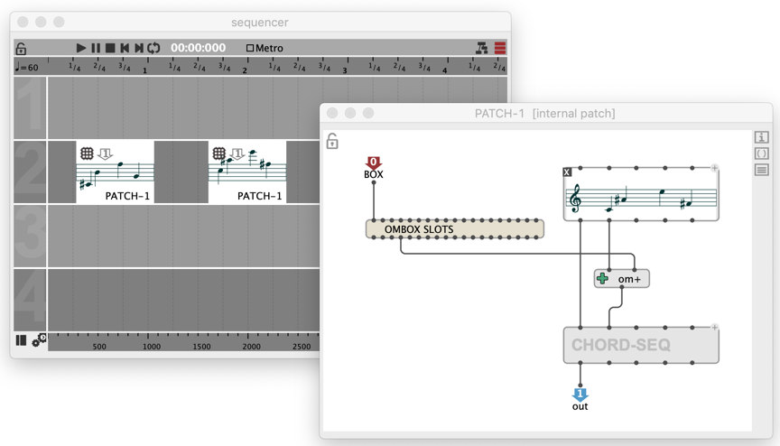
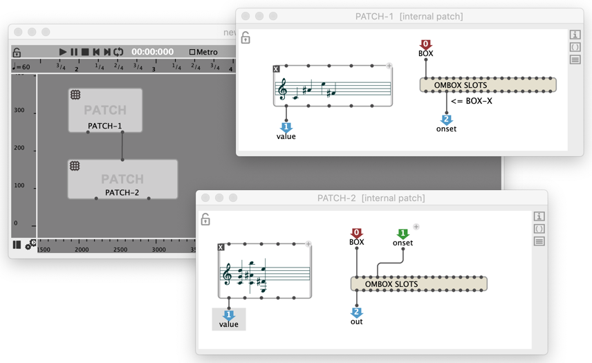
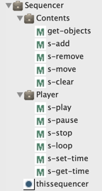
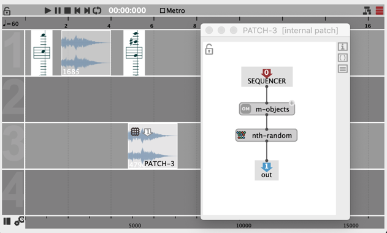
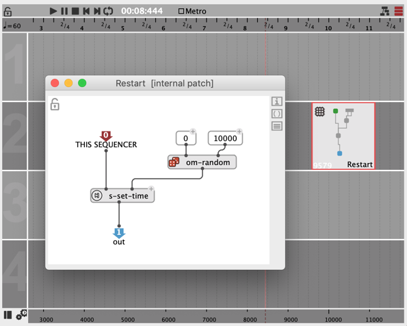
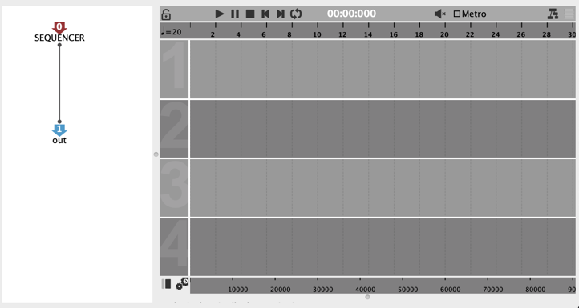
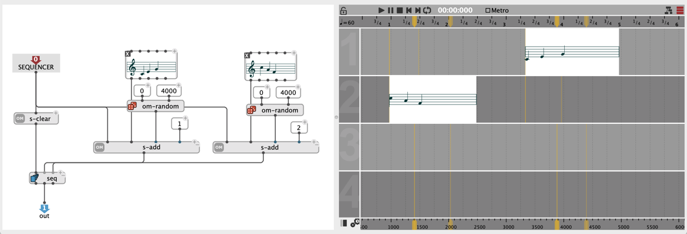

# Sequencer programming

As an extension of the [patch](patch), the [sequencer](sequencer) allows building programs and [evaluating](eval) anytime, and from anywhere.
As a musical construction, the sequencer also offers other interesting programming features.

- The <kbd>V</kbd> shortcut evaluates the selected boxes.
- The button  on the sequencer window reevaluates all the sequencer contents at once (every box and the "control patch" -- see below).

## Embedding programs in time

Sequencers can contain sub-patches.

To add a patch in a sequencer:
- Drag a patch box from somewhere else
- <kbd>Ctrl/⌘</kbd> + click (or double-click in "maquette" view and type "patch")
- (see [other means to create abstraction boxes](abstraction))

If the first output of a patch is a playable/musical, it will be integrated in the sequencer output for playback. Otherwise inputs and outputs can just pass data in and out between programs and objects in the sequencer.

> – _This patch generates a musical sequence (first output) for the sequencer. It also passes data out to another patch box:_          
> 
>
> _Note how the boxes are connected in **maquette** view:_       
> 
>

> ### Reactive evaluation during playback
>
> **When a box in the sequencer is as at least one [reactive](reactive) output, it is also reevaluated when the play cursor reaches it**.
>
> In order to anticipate the calculation, a "pre-delay" (in milliseconds) can be assigned to every box.
>
> 

## Programming with box properties

Using the [tools of the "Meta programming" package](meta), a patch box in a sequencer can access (and modify) information about its own containing box and context.

**`thisbox`** is a special input providing an access to the box containing the current patch. All its properties are accessible (size, color, name, position). The position is a particularly interesting parameter, considering that the x/horizontal axis represents the time of the resulting musical structure in the sequencer.

In order to query or set the box properties, use the [`SLOTS` box](slots#a-use-case-of-setting-slot) with the `OMBox` class.

> — _In this example, PATCH-1 transposes a sequence of a given amount of midicents, corresponding to its own time/x-position:_       
> 

> — _In this example, PATCH-2 always sets itself at the same time/x position as PATCH-1:_     
> 

> **Note:** **`thisbox`** can also be used in a regular patch, outside of the sequencer context.

## Programming with the sequencer contents

The box **`thissequencer`** is another special input providing access to the containing sequence.    

The functions of the "Sequencer" package also allow adding, removing, modifying or accessing all other boxes in this sequence.

> — _In this example, PATCH-3 steals the contents of an other box chosen randomly in the sequencer:_     
> 

## Controlling the player

The functions in the "Player" sub-package (`s-play`, `s-stop`, `s-loop`, ...) control the player of the maquette editor.

> – _This reactive patch sets the time of the player to a random place between 0 and 10s when the playhead reaches it._     
> 

## Control patch: a reflective program

> _In computer science, reflective programming or reflection is the ability of a process to examine, introspect, and modify its own structure and behavior._ [[Wikipedia]](https://en.wikipedia.org/wiki/Reflective_programming)

The sequencer has a secondary "control patch" which allows controlling or generating its main contents.

&rarr; Use the  to open/close the control patch in the editor.

The control patch is evaluated when the [sequencer box](sequencer) is evaluated inside another patch, or when the sequencer is evaluated using the  button (see [Evaluation of the sequencer](#evaluation-of-the-sequencer)).

Its inputs/outputs correspond to the inlets/outlets of the [sequencer box](sequencer#sequencer-box): the sequencer can be parameterized or transfer any data to its own container program.

By default, the control patch returns the sequencer itself: the output is simply connected to the [meta-programming](meta) box **`thissequener`** (see below):

Therefore the [sequencer box](sequencer) by default has one output, which returns the sequencer:

Anything can be programmed in this patch. 
In particular, utilities from the ["Meta"](meta) and ["Sequencer"](programming-with-the-sequencer-contents) packages allow manipulating the contents of the sequencer, or [controlling the player](#controlling-the-player) from there.

> — _This control patch generates two boxes at random positions between 0 and 4000ms on tracks #1 and #2, each time the sequencer is evaluated:_
> 

> **Note:** The control patch can also be partly reactive and receive commands for updating the maquette contents or player, sent by the boxes inside or from external processes, including during playback.    
> **&rarr; See [Reactive Processes](reactive).**

