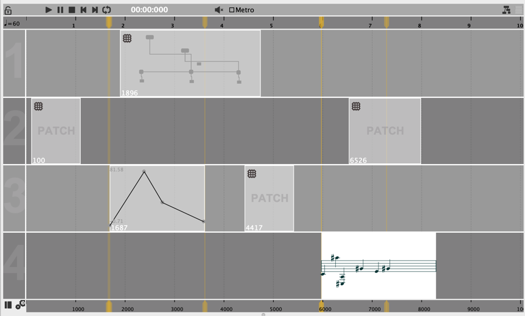
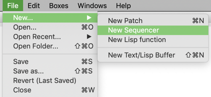
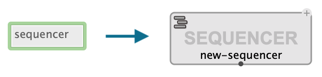
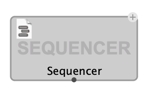
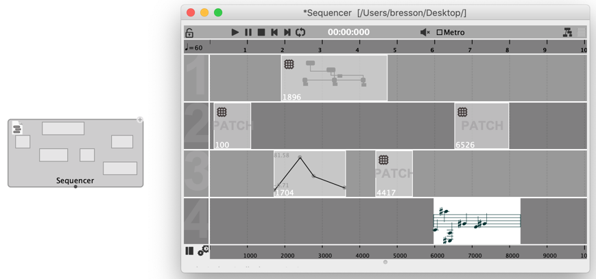
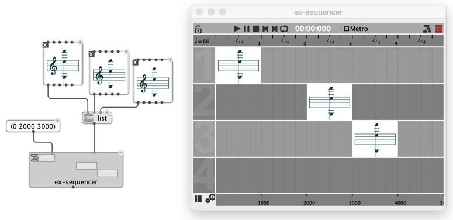

# Sequencer (Document/Box)

The **sequencer** is a document and musical container organizing musical objects and processes in time.

A sequencer can contain:
- [Object boxes](objects), scheduled in a common time referential
- [Abstractions (patches)](abstraction), producing musical objects, or any other data
- Other [function boxes](function-box) connecting all these together.

Following the OM# document framework, the sequencer can be used as a top-level container [document](doc-management), or embedded in a patch as an [abstraction box](abstractions).

### Create a new sequencer document:

- Use the menu "File / New... / New Sequencer"

### Create an embedded sequencer in a patch:

- Double-click or type <kbd>N</kbd> to open the box name input field, and type "sequencer".
- Right click or use the menu "Box/Add Box/Internal sequencer", then click somewhere in the container patch to create the new sequencer box.

### Embed a sequencer document in another document:

- Drag the corresponding file (**.oseq**) from your system Desktop manager.
- Use the menu "Box/Add Box/External abstraction", click somewhere in the container patch and select a .oseq file from the file-chooser dialog.
- Type <kbd>P</kbd> and enter the relative or full pathname of the file.

### Convert an embedded document to a local sequencer inside a patch:

- Select the sequencer box and use the menu "Boxes / Internalize abstractions" (shortcut <kbd>A</kbd>).

### Extract an internal sequencer as a standalone document:

- Open the document and use the menu "File / Externalize" then choose a new file name and location to save the document.

> See also: [Abstractions](abstraction)

## Sequencer Box

The sequencer box behaves just like a patch box in many respects (see for instance [Inspect and edit attributes](inspector)).

The "mini view" display mode (<kbd>M</kbd>) provides an overview of the contents.

Just double-click to open, edit, and play the sequencer contents.

> **More in [Sequencer (Editor)](sequencer-editor)**

The sequencer box unique output, by default, returns the sequencer itself.
Other values can be returned through the sequencer's [control patch](sequencer-programming#control-patch-a-reflective-program).

## Build the sequencer programmatically

Sequencer boxes have two [optional inputs](box-inputs#optional). These inputs allow setting the contents of the sequencer from the patch containing a sequencer box.

> **Note:** Other inlets and outlets of the sequencer box can be created through the sequencer's [control patch](sequencer-programming#control-patch-a-reflective-program).
> **&rarr; See [Sequencer (Programming)](sequencer-programming)**

## Compatibility note

> The sequencer is an extended version of the OpenMusic "maquette". Maquette files (.omm) can be imported from OpenMusic OM# and converted to OM# sequencer documents (.oseq).
>
> &rarr; See [How to import an OM document](import-from-om).
