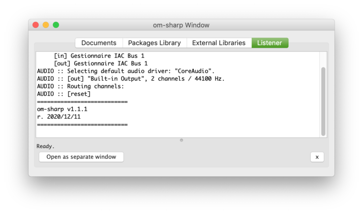
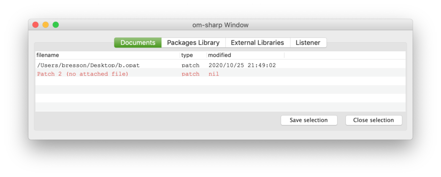
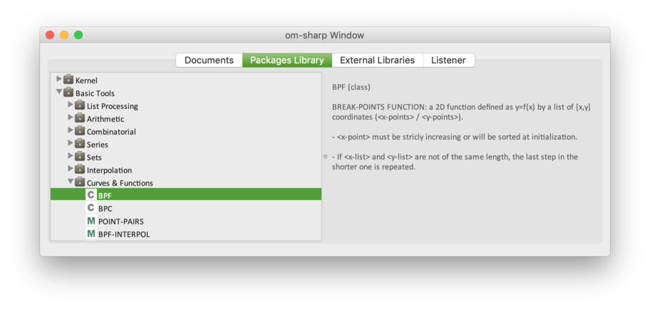
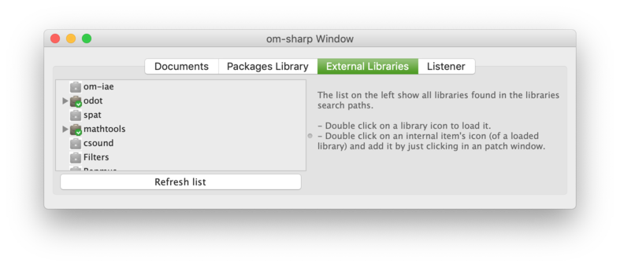

# Session window

The main window of an OM# session is called the "Session Window". 
From there you can control your general working environment.

> Open/bring the Session Window to front at any time using the "Windows" menu of the  <kbd>Ctrl/⌘</kbd> + <kbd>shift</kbd> + <kbd>W</kbd> short-cut.

**The Session Window has 4 different tabs:**

### The **Listener** tab

This tab opens by default at starting a new session. This is where you will see all system outputs, warnings, and errors.   
Note that it is also possible to open the Listener as a separate window, using the "Open as separate window" button at the bottom, or using the Windows menu and short-cut. The separate Listener window offers a number of additional options, for instance if you would like to _input_ Lisp commands to the system. See [Listener](listener) for more details.

### The **Documents** tab 

This tab lists all open documents (mostly, patches/visual programs), displaying their pathname (if any), last modification date, etc. 
**Double-clicking on an item opens the document, or brings its window to the front.**

Documents displayed in red have no pathname (either don't have one, or point to a non-exiting file), and need to be saved/re-saved. 
See [Document Management](doc-management) for more details. 

> Note that only _open_ documents are listed. When a document window is closed (and if it is not used inside another document) it is removed from the list. 
Closed documents may remain in the list if they are still used somewhere, inside other documents (see [Abstraction](abstraction)). 

The "Save selection" and "Close selection" buttons save or close all selected documents in the list.

### The **Packages Library** tab 

> A **package** is a collection of tools: functions, classes (possibly organised in sub-packages) that you can use in visual programs.

In this tab are listed all the "packages" in-built in the environment.

Open/browse packages using the triangle icons on the left, in order to see the list of functions and classes they contain.
Click on an item to display its documentation on the right.

> **Hint:** Double-click on an item if you want to use it in an open patch, then just click somewhere in the patch window to create the corresponding box.

### The **External Libraries** tab 

> An **external library** is an additional package that can be plugged into the environment.

This tab lists all external libraries that are detected by the environment. 
Notice the different icons for libraries that are loaded (brown, with a green label), and not loaded (grey/disabled). 

=> Double click on a library to load it, and brows its contents just like in the previous tab.

> See also: [Libraries](libraries)
