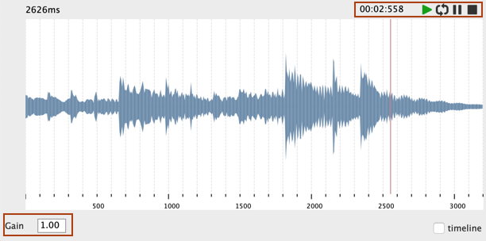
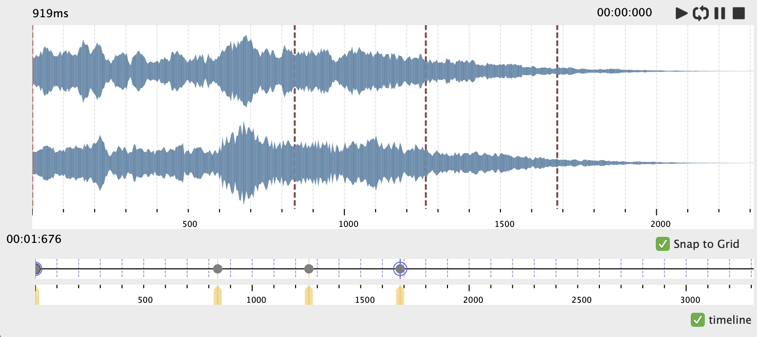
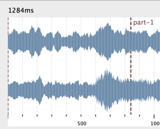
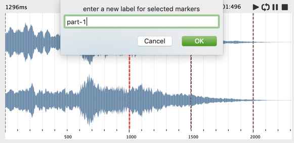
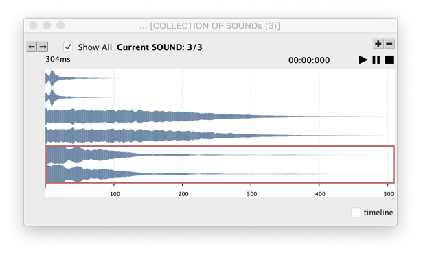

# Sound editor

The sound editor opens when double-clicking a [`SOUND` object](sound).

## Visualization

The sound editor has the usual horizontal rulers for zooming in/out and scrolling through the sound.

## Player

The sound editor provides the usual player transport controls, which allow hearing or looping through the loaded sound file or sound buffer.

A global gain can be set from the editor.

 

## Markers

Markers can be added, removed, or edited in the sound editor.

- <kbd>Ctrl/⌘</kbd> + click to add a marker.
- Click on a marker to select it.
- Drag a selected marker to move it in the sound.
- Use the <kbd>backspace</kbd> key to remove a selected marker.

> Markers are also be represented and edited in the internal ["timeline"](time-sequence#timeline-editor) of the sound editor:    
>
>  

#### Labels

Sound markers can be associated to a "label". The elements of the list of markers coming in and out of the sound's `:marker` slot can actually be a list of the form `(time label)` (e.g. `(1000 "marker-1")`). The label is displayed next to the marker:   

 

Marker labels can be edited from the sound editor:

- Use <kbd>L</kbd> to set the label of any selected marker.
- Use <kbd>shift</kbd> + <kbd>L</kbd> to remove the label of selected marker(s).

 

> **Note/Reminder:** Markers (and labels) can also be set and accessed through [the `:markers` slot of the `SOUND` box](sound#other-attributes).

## Collections

The `SOUND` editor supports integration in the [`COLLECTION`](store-collect#collection) editor, where several `SOUND` objects can be visualized and played. 

