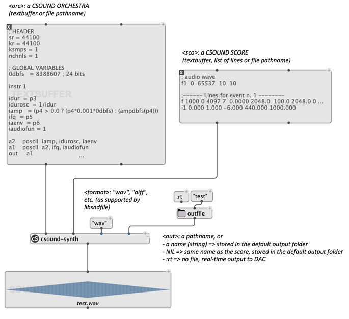
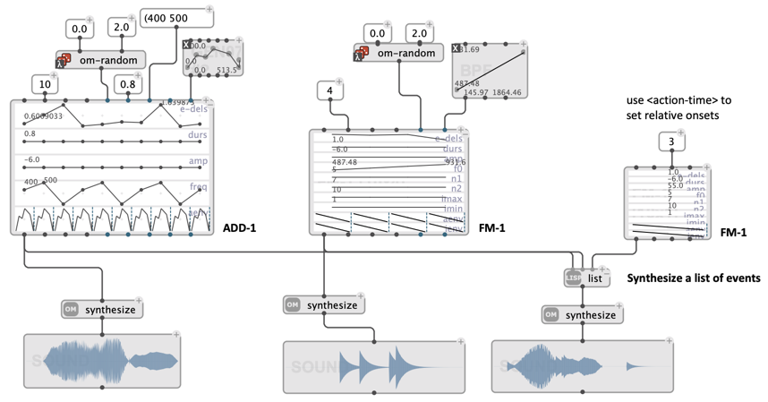
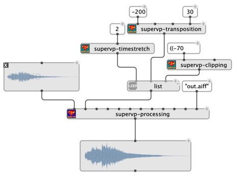
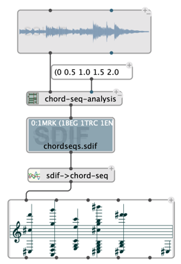
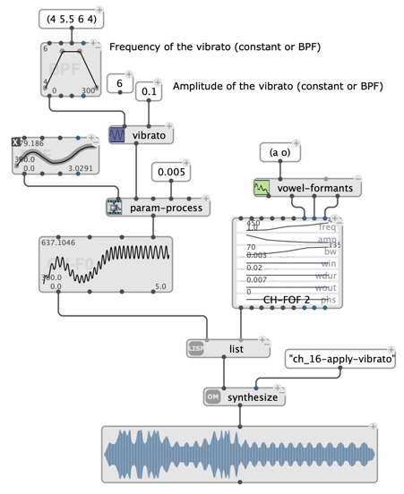
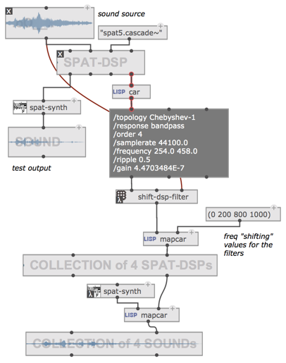
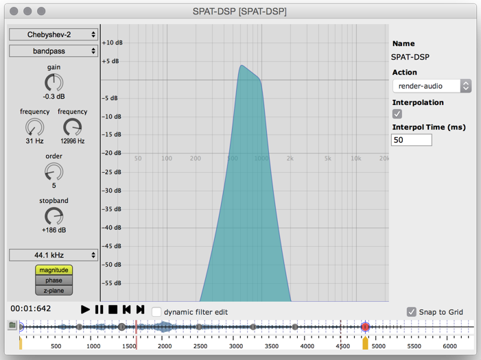
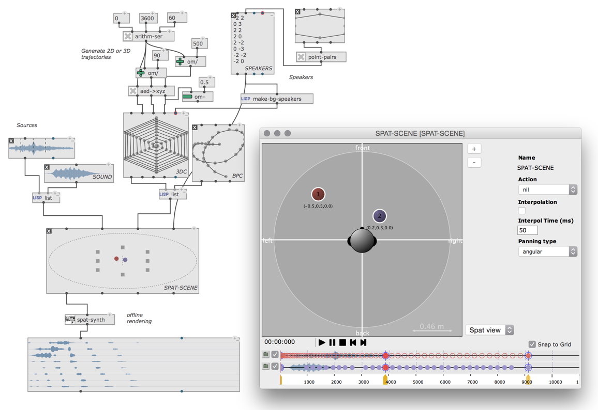
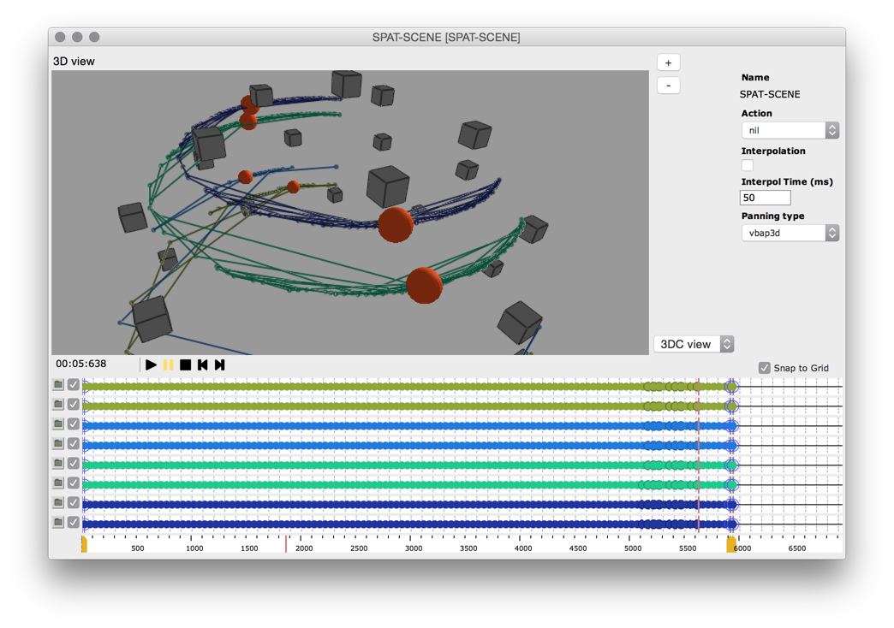

# Sound Analysis/Synthesis Libraries

Some [external libraries](../#externals--libraries) bring powerful sound processing and synthesis capabilities in to OM#. Conversely, OM# can be a powerful environment to control of the corresponding signal processing engines.

- [Csound](#csound)
- [OMChroma](#omchroma)
- [OM-SuperVP / OM-pm2](#sound-analysis-using-supervp-and-pm2)
- [OM-Chant](#om-chant)
- [Spat](#spat)

## Csound

The **[csound library](https://github.com/cac-t-u-s/csound/)** is a simple tool to run Csound synthesis processes specified from text files or [text buffers](text-buffer). 

> &rarr; Get Csound: [https://csound.com](https://csound.com)

 

## OMChroma

OMChroma controls Csound synthesis using advanced structures and programming techniques.
**[OMChroma for OM#](https://github.com/openmusic-project/OMChroma)** is an adaptation of this library using with the new matrix and sound processing objects of OM#.

> &rarr; See also: [OMChroma: Compositional Control of Sound Synthesis](https://hal.archives-ouvertes.fr/hal-00683465). Computer Music Journal, 35(2) 2011.

 

## Sound analysis using SuperVP and pm2

SuperVP and pm2 are two signal analysis and processing kernels developed at [IRCAM](https://www.ircam.fr), respectively based of short-term Fourier transform ("sonogram") and sinusoidal models ("partials"). They were notably used as sound processing engines of the [AudioSculpt](https://forum.ircam.fr/projects/detail/audiosculpt/) software.

The libraries **[OM-SuperVP](https://github.com/openmusic-project/om-supervp)** and **[OM-pm2](https://github.com/openmusic-project/om-pm2)** for OpenMusic are compatible with OM#. They both require an [IRCAM Forum subscription](https://www.ircam.fr/innovations/abonnements-du-forum/) to unlock the included sound processing engines.

**OM-SuperVP includes:**
- Fundamental frequency analysis
- Transient detection
- SFFT analysis
- Formant analysis
- Time stretching
- Frequency shifting
- Sound transposition
- Various kinds of filters
- Clipping
- Freezing
- Source-filter synthesis
- Cross synthesis

All transformations can be controlled over time with BPFs or other advanced specification syntax.

**OM-pm2 includes:**
- Partial-tracking analysis
- "Chord sequence" analysis
- Fundamental frequency analysis
- Additive synthesis

 
 

## OM-Chant

**[OM-Chant](https://github.com/openmusic-project/om-chant)** is an OpenMusic library for the control of the Chant synthesizer, which simulates sung voice sounds as well as more abstract sounds using the FOF synthesis technique.

> &rarr; See also: [OM-Chant pages](https://github.com/openmusic-project/OM-Chant/wiki)

## Spat

The **[Spat](https://github.com/cac-t-u-s/spat)** library connects OM# with the IRCAM [Spatialisateur](https://forum.ircam.fr/projects/detail/spat/) kernel. 
The various DSP processors included in the library can be controlled over time via Spat control interfaces and OM# ["timeline" interfaces](time-sequence#timeline-editor), which enables advanced parameterization and real-time/offline rendering of sound spatialization processes.

 
 
 
 
