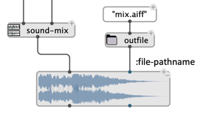

# Sound Processing

The "Audio" package of OM# provides a set of digital sound processing operators: 
- `sound-cut`
- `sound-fade`
- `sound-mix`
- `sound-seq`
- `sound-normalize`
- `sound-gain`
- `sound-mono-to-stereo`
- `sound-to-mono`
- `sound-stereo-pan`
- `sound-merge`
- `sound-split` 
- `sound-resample`
- `sound-loop` 
- `sound-reverse`
- ...

All these operators output an intermediate representation of type `internal-sound`.    
They can handle inputs of type `SOUND`, or `internal-sound` (output of another operator). 

> The `internal-sound` output by sound processing operators can be turned to a `SOUND`object by connecting it to the `SOUND`box. 

 

## Save to disk

The `internal-sound` coming out from sound processing operators can be saved on disk using the `save-sound` function:

 

Another option to save the output to disk is to connect it to a `SOUND` box with a pathname specified as `:file-pathname` [attribute](sound#parameters).

