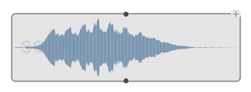
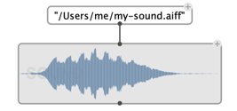
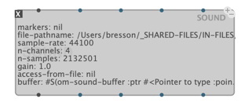
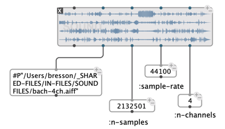
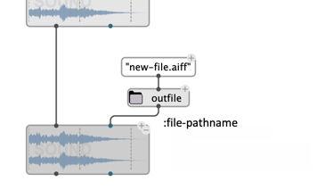
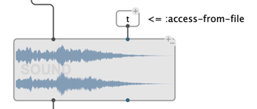
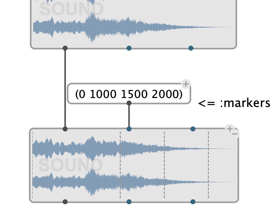

 

# `SOUND`

The `SOUND` box is the main object used to manipulate both audio files and audio buffers.

## Initialization

The first input (`self`) of the box is used to initialize the internal audio buffer of the `SOUND` object. This can be either from another `SOUND` object, from an `internal-sound` (e.g. output from [sound processing operators](sound-processing)), or from a pathname.

 

When nothing is connected (and if the box is not [locked](eval-modes#lock-state)) a file-chooser dialog opens when evaluating the `SOUND` box. 

Once initialized, a few attributes from the sound (number of channels, number of samples, sample rate, file patname) can be read on the box (in ["text" visualization mode](objects#visualization)) or from the corresponding box outputs.

 
 

> **Note:** These attributes can not be "set" directly. Connecting values to the corresponding inputs has no effect.

## File access

When specified as input, the `:file-pathname` attribute stores or copies the incoming sound to the designated file.

 

The `:access-from-file` attribute of the sound determines whether the sound data sould be accessed from the disk (when available) or loaded and accessed as an internal buffer.

 

> _Sound file access from disk is slower in general, but uses less RAM from the program._

## Other attributes

- The `:gain` attributes applies when playing the sound. It can be set throught the box input, or in the [sound editor](sound-editor). 

- The `:markers` attributes is a list of markers (time in milliseconds) that can be set, displayed, and extracted from the sound.    
*Note:* A marker can also be a list `(time "label")` where _"label"_ is a string displayed with the time marker.
&rarr; See [Markers](sound-editor#markers).

 

## Play

Use the standard play controls to play/stop a `SOUND`. (Space-bar from a patche editor).   
&rarr; See [Player](player)

## Editing

Double-click on the `SOUND` box to open the sound in the [Sound editor](sound-editor).
