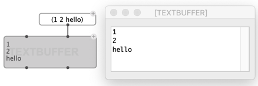
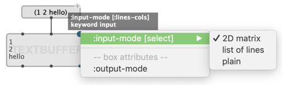
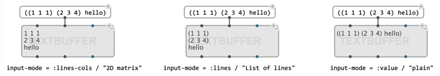
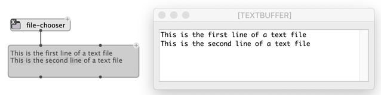
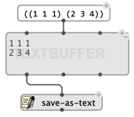
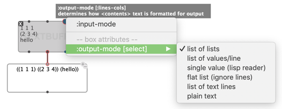
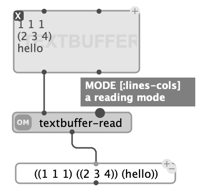
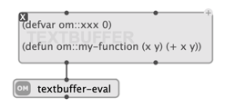

# `TEXTBUFFER`

`TEXTBUFFER` is a box used to store and edit texts or other data in OM#.

The contents is set or read through the `contents` input/output of the `TEXTBUFFER` box.
It can be edited text by opening the box editor.



## Initialization / setting contents

Contents is interpreted either as numbers, symbols or lists.

By default the `TEXTBUFFER` interprets list inputs in `contents` 1- or 2-dimensinal arrays, converted to as many lines of text: **each item becomes a new line, and if the elementitem is a list, each sub-item in this list becomes a new element in the same line**.

The [additional input](box-inputs#keyword) `input-modes` allows selecting different ways of interpreting the input data:



The two other options are:
- "list of lines": each element is just interpreted as a line on its own (no reading and formatting of sub-list)
- "plain": the input is formatted as such in the textbuffer contents



## Loading from disk / Saving to disk

A `TEXTBUFFER` can also be initialized from an existing text file, by connecting the file path to the first/`self` input of the box.



The contents of a `TEXTBUFFER` can also be saved to disk at any time using the "Save" menu of the text editor, or using the `save-as-text` function:



## Reading contents

`TEXTBUFFER` contents can be read through the `contents` output.

The default reader behaviour is to interpret the contents as a 2-dimentional array (a list of list) and return a nested list of lines, where each line is a list of data.

Other options are also proposed through the other additional ["box-attributes"](objects#box-attributes) input:



> #### With the example above:
>
>````
>1 1 1
>(2 3 4)
>hello
>````
>
>* "list of lists" (default) returns: `((1 1 1) ((2 3 4)) (hello))`    
> _Note how `(1 2 3)` has been embedded in a nested list, as the single element of a line._
>* "list of values/lines" returns a single value per line: `(1 (2 3 4) hello)`    
> _Note how only one element was read and returned fron line #1._
>* "single value" returns: `1`    
> _Note how everything but the first read value is ignored. This case is typically useful when the whole contents is wrapped into a single list._
>* "flat list" returns: `(1 1 1 (2 3 4) hello)`    
> _A list containing all the data, regardless of line breaks._
>* "list of text lines" returns: `("1 1 1" "(2 3 4)" "hello")`  
>* "plain text" returns: `"1 1 1\n(2 3 4)\nhello"`    
> _Where `\n` represents a line break.

`TEXTBUFFER` contents can also be read using the `textbuffer-read` function (connected to the first / `self` output of the box), which provides the same reading options in its second input.    



## Lisp

The contents of the `TEXTBUFFER`can be evaluated as Lisp code using the `textbuffer-eval`function:



> **Note:** Using dedicated tools like the [Lisp Fuction box](lispfun-box) can be more appropriate to type in and evaluate Lisp functions.