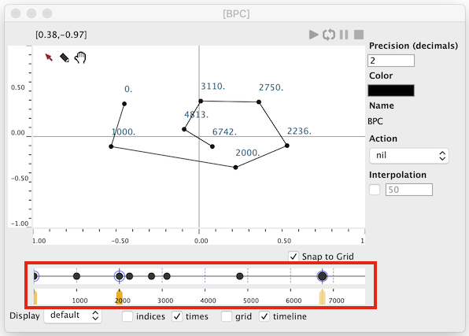
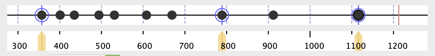
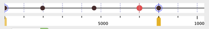
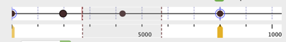
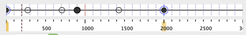
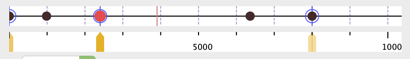

# Time-sequences

Most "playable" objects in OM# implement the notion of "time sequence": they can be considered as a sequence of "timed item" (i.e., anything that has a position in time, and eventually a duration).

Example of "time sequences" are: [`BPF`](bpf), [`BPC`](bpc), [`3DC`](3DC) (all representing a sequence of timed-points), but also [`DATA-STREAM`](data-stream), and its subclasses: [`MIDI-TRACK`](midi-track), [`CHORD-SEQ`](chord-seq), [`VOICE`](voice)...

> ### Actions
>
> The actions triggered by the timed items in the sequence vary along with the different sub-classes of time sequences.
>
> Some objects have predefined actions (e.g. audio, MIDI events, ...) while others can be freely assigned (e.g. BPF, BPC...).

Time sequences can generally be edited thanks to a "timeline editor" included in the different object's editor window.

_A BPC editor and its "time-line" view._

# Timeline Editor

The timeline editor is a simple view representing the timed items as circles on a horizontal line representing time.

The timeline editor has a horizontal time ruler which allows scrolling and zooming in and out in the time sequence.

Timed items can be translated in time using mouse drag operations, or using the <kbd>&larr;</kbd> / <kbd>&rarr;</kbd> keys.

_The order of the timed items can not be changed_, and translation will always be blocked at the immediate proximity of surrounding timed items.

The timeline editor also allows adding timed-items (whatever they are!) using <kbd>Ctrl/⌘</kbd> + click, or removing them using the <kbd>backspace</kbd> key.

## Timing

The timeline editor supports [player interactions](player), by setting the cursor position (with a double click) and play intervals (by a dragging of the cursor).

### Un-timed items

Not all the items in a time sequence need to have a fixed time (this is particularly relevant for time sequences like the [`BPC`](bpc) object).
When an item has no time, its actual timing is calculated by interpolation between the two closest timed items.

Un-timed items are represented by an empty circle. They get a time as soon as they are manually edited from the timeline editor.

### "Master" timed items

Some items in a time sequence can be set to a status of "master" items, and displayed with an additional circle in the timeline editor.

Use the <kbd>M</kbd> key ti set/unset this status.

Moving a _master_ point (using mouse drag operations, or using the <kbd>&larr;</kbd> / <kbd>&rarr;</kbd> keys) stretches/compresses all the timed items situated between this point and its neighbouring master points.

> **Note:** The first and last items of a sequence are always considered as "master" points.

